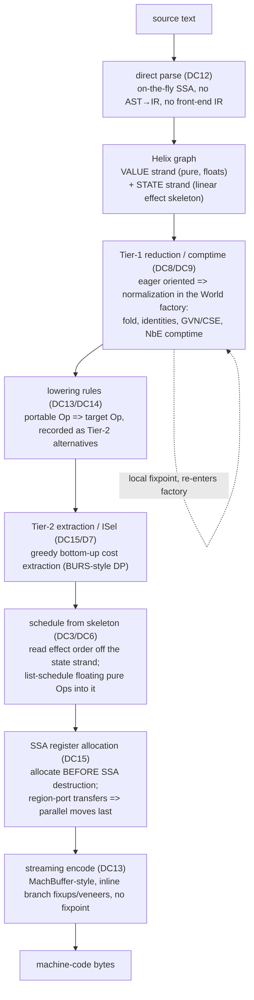

# Helix — One Graph, One Reduction, Source to Silicon

*The wiki home. Start here: the thesis, the honest pitch, how Helix compares to the prior art, the model in brief, the end-to-end pipeline, and a recommended reading order for the whole wiki.*

**Helix** is a new compiler IR graph. Its one-line thesis: **ONE graph, ONE reduction, source to silicon** — a single acyclic hash-consed SSA graph in which optimization, compile-time evaluation, instruction selection, and lowering are all the *same* rewrite process, parsed directly from source and emitted directly to machine code with **no secondary IR at either end**.

---

## 1. The honest pitch (read this before anything else)

It would be easy to over-claim here, so we do not. **No prior graph IR — RVSDG/jlm, Thorin, MimIR — has been shown to BEAT LLVM/GCC `-O3` output quality.** They emit LLVM IR and aim to *match* it. Helix does not pretend to clear a bar nobody has cleared. What Helix actually claims:

1. **Conceptually simpler and a dramatically smaller codebase** than Sea-of-Nodes / RVSDG / Thorin / MimIR — a center-of-mass estimate of **~7.5k–8.5k LoC** for a first mature single-ISA implementation (see [Implementation Plan](19-implementation-plan.md)).
2. **Matches the best graph IRs on optimization through STRUCTURAL wins** — GVN, LICM, and DCE emerge *from the form itself* (hash-consing, single-origin edges, the pure/state split) rather than from expensive equality saturation.
3. **Uniquely unifies comptime evaluation AND machine-code emission into the graph itself** — the same Tier-1 reduction that folds `add 2 3 => 5` *is* the comptime evaluator, and target-ISA opcodes are ordinary nodes in the same graph.
4. **Zero IR round-trip at either end** — parse directly into the graph, emit machine bytes directly out of it; no front-end IR, no secondary backend IR.

Where a claim is risky, we say so and point at the risk register. The two load-bearing risks are **R1** (matching, not beating, `-O3`; "optimizes better" and "smaller codebase" are partly in tension) and **R3** (owning instruction selection + scheduling + register allocation means owning NP-hard problems; output quality lags LLVM until the backend matures). Intellectual honesty makes the plan stronger, not weaker — see the [risk-register summary](#8-risk-register-summary) below and the full [Risks and Open Problems](22-risks-and-open-problems.md).

---

## 2. At a glance — Helix vs the prior art

Summarized from the prior-art matrix in [the synthesis](research/00-synthesis.md). The point of the table is *what Helix borrows and what it declines*.

| | **Sea of Nodes** | **RVSDG** | **Thorin** | **MimIR** | **Helix** |
|---|---|---|---|---|---|
| Core abstraction | one graph fusing data + control + memory | acyclic hierarchical regions; value/state edges | higher-order CPS sea-of-nodes | sea-of-nodes over a dependently-typed PTS | one acyclic hash-consed SSA graph; **two strands** |
| Control flow | explicit control edges + `Region`/`Phi` | structured γ (gamma) / θ (theta) regions | continuations (CPS) | CPS as `Cn T ≡ T→⊥` | structured `Cond`/`Loop` regions; **block-param ports, no phi** |
| Effects / memory | SSA-of-memory + memory phis | typed value/state edges; multi-state possible | `mem` token | linear `%mem.M` token (**linearity unenforced**) | linear **state strand**, fine-grained, **enforced** |
| Optimization | combined CCP+DCE+GVN fixpoint + worklist | single-pass graph traversals | lambda mangling + `World` fold/CSE | normalizers + β/PE + pass pipeline | **Tier-1 eager normalization** (structural GVN/LICM/DCE) + bounded Tier-2 overlay |
| Comptime / PE | none in core | none (future work) | online PE (~500 LoC) + filters | filters; same engine type-checks | **comptime = Tier-1 reduction** (NbE + filters + fuel) |
| Path to machine code | GCM → CFG → matcher → regalloc | **destruct** → emits **LLVM IR** | schedule → emits **LLVM IR** | plugins → emits **textual LLVM IR** | **direct: graph → bytes, no secondary IR** |
| Codebase | C2/Graal among the hardest in the JDK | jlm ~161k LoC (bridge ~94.6k) | ~97.6% C++ | ~32k LoC (core ~9.4k) | **~6k–9k LoC est.** |
| Key weakness | "soup of nodes"; float collapses under effects | costly CFG round-trip; conservative single-state | CPS cognitive cost; non-semantic names | dependent types steep; checker can diverge | **owns the NP-hard backend (R3); matches not beats -O3 (R1)** |

Helix's "stolen ideas," in one breath: the **unified graph** (Sea of Nodes), **single-origin edges + structured γ/θ + acyclic recursion + value/state edges** (RVSDG), **eager `World` normalization + one rewrite primitive + filter-driven PE** (Thorin), **immutable/structural vs nominal split + minimal taxonomy + comptime = PE** (MimIR), and the **pure/effect skeleton + one verifiable rule DSL + direct VCode→bytes backend** (Cranelift). It *declines* full equality saturation, dependent types, CPS-as-core, and any CFG round-trip.

---

## 3. The two strands

Every Helix edge is exactly one of two kinds — this is the central metaphor.

- **VALUE strand (pure):** duplicable, foldable, **floats** freely; placed only at scheduling time. Pure data dependencies. An `Op` with no state edge is pure.
- **STATE strand (linear effect skeleton):** a value of a `state` type, threaded **linearly** (used exactly once), **pinned** and ordered. This is the side-effect skeleton. An effectful `Op` consumes one state token and produces a new one.

The double strand replaces sea-of-nodes' separate control/data/memory edges and RVSDG's state edges in one mechanism, directly implements the proven "pure floats / effects pinned" hybrid (Cranelift/PEG), and **enforces linearity structurally** — closing MimIR's admitted unenforced-linearity hole. Multiple **fine-grained** state tokens (per alias class / region) exist from day one, so provably-disjoint effects carry no ordering edge between them. Full treatment in [Core Model](11-core-model.md) and [Types and Effects](13-types-and-effects.md).

---

## 4. The six node forms

Helix has **exactly six node forms** — minimal by design (DC17). Two are structural (pure, immutable, hash-consed, float); four are nominal/region (mutable, introduce binders = **ports**, host a sub-graph).

```
                          HELIX NODE TAXONOMY (exactly six forms)
                                       │
           ┌───────────────────────────┴───────────────────────────┐
   STRUCTURAL (pure, immutable,                       NOMINAL / REGION (mutable,
   hash-consed DAG, FLOAT)                            introduce PORTS = block params,
           │                                          host sub-graphs)
     ┌─────┴─────┐                         ┌──────────┬──────────┬──────────┐
     │           │                         │          │          │          │
   Const         Op                      Cond       Loop       Func       Module
  literals    opcode +                 symmetric  tail-      function/  translation
  AND types   operands                 conditional controlled closure    unit, globals,
  (shallow)   (+ opt. state            / switch    loop       (lambda λ) recursion groups
              in/out; target           (gamma γ)  (theta θ)              (omega ω / delta δ /
              ISA ops after                                              phi φ recursion)
              lowering)
```

| # | Form | Family | Role | RVSDG analogue |
|---|---|---|---|---|
| 1 | `Const` | structural | literals **and types** (types are values; shallow, not dependent) | constant |
| 2 | `Op` | structural | opcode + operands (+ optional state in/out); covers arithmetic, compare, select, address calc, and **target-ISA opcodes after lowering** (e.g. `x64.lea`) | simple node |
| 3 | `Cond` | nominal | symmetric conditional / switch; branch regions share input ports, produce same result ports | γ gamma |
| 4 | `Loop` | nominal | tail-controlled loop **without a graph cycle**; loop-carried values are ports | θ theta |
| 5 | `Func` | nominal | function / closure; parameter ports, result ports, optional state in/out | λ lambda |
| 6 | `Module` | nominal | translation unit: top-level funcs, globals, recursion groups (**recursion lives here, not as a graph cycle**) | ω omega + δ + φ |

Region **ports are block parameters** (DC5) — there are **no phi nodes anywhere** in Helix. Four hard structural invariants hold *by construction*: **acyclic** (a DAG; loops/recursion are region nodes, never back-edges), **strict SSA** (every value edge single-origin), **hash-consed** (structural equality == pointer equality == automatic GVN/CSE for closed terms), and **linear state** (each token used exactly once, enforced). See [Core Model](11-core-model.md).

---

## 5. The end-to-end pipeline

Source to silicon, all on the **same** graph — no secondary IR at either boundary.



Nothing between the optimized graph and the bytes is a separate IR: stages mutate node *attributes* (selected tile, assigned register, schedule index); only the final encode produces a byte array. The existence proof for the whole back-end path is Cranelift's VCode + regalloc2 + MachBuffer. Detail: [Frontend](18-frontend.md), [Reduction Engine](14-reduction-engine.md), [Comptime](15-comptime.md), [Codegen](17-codegen.md).

The two tiers, in brief:

- **Tier 1 — eager oriented normalization ("smart constructors").** Every node-construction goes through the **World factory**, which applies oriented `=>` rewrite rules to local fixpoint *at construction time*: constant folding, algebraic identities, CSE (via hash-consing), comptime β/δ reduction. This is the **main engine and also IS the comptime evaluator** (via Normalization-by-Evaluation). No worklist sweeps, no equality-saturation fixpoint.
- **Tier 2 — bounded equivalence overlay (used sparingly).** For choices with no single canonical best form — primarily **instruction selection** alternatives and a little reassociation — alternatives are recorded as union nodes in an **acyclic, append-only** overlay and a min-cost form is chosen by **greedy bottom-up cost extraction**. This is *not* full equality saturation (D7): Cranelift's data shows saturation buys ~0.1% for real cost, and optimal DAG extraction is NP-complete.

One shared, SMT-verifiable rule DSL drives all of it: `=>` oriented (Tier 1, eager), `~` equivalence (Tier 2, sparingly), `lower … @cost` (lowering/ISel), `{..}` host fold, `?x` pattern var, `if` guard.

---

## 6. Recommended reading order

Read top to bottom for the full argument; jump by interest using the descriptions.

**Foundations — the prior art that forces every decision**

1. [research/00 — Synthesis](research/00-synthesis.md) — the prior-art matrix, twelve failure modes, and the DC1–DC17 / D1–D7 / R1–R7 registers everything else cites. *Read this first if you read only one research page.*
2. [research/01 — Sea of Nodes](research/01-sea-of-nodes.md) — Click's unified graph; the "soup of nodes" and float-collapse lessons.
3. [research/02 — RVSDG](research/02-rvsdg.md) — γ/θ/λ/δ/φ/ω, value/state edges, the CFG round-trip cost.
4. [research/03 — Thorin](research/03-thorin.md) — CPS sea-of-nodes, lambda mangling, Schism-style filters, the `World`.
5. [research/04 — MimIR / Thorin 2](research/04-mimir-thorin2.md) — dependently-typed PTS, comptime = PE = type-check, minimal taxonomy.
6. [research/05 — E-graphs & Equality Saturation](research/05-egraphs-eqsat.md) — egg/egglog, Cranelift aegraph, why we decline full saturation.
7. [research/06 — SSA & MLIR Landscape](research/06-ssa-mlir-landscape.md) — block parameters vs phi, progressive lowering, the SSA context.
8. [research/07 — Comptime & Partial Evaluation](research/07-comptime-partial-eval.md) — NbE, neutral terms, Futamura, fuel/quota lineage (Zig, C++).
9. [research/08 — Backend / Direct Codegen](research/08-backend-direct-codegen.md) — VCode, regalloc2, MachBuffer; the existence proof for no-secondary-IR emission.

**The Helix design**

10. [10 — Design Rationale](10-design-rationale.md) — every decision traced to a DC / failure mode / differentiator / risk; the honest thesis.
11. [11 — Core Model](11-core-model.md) — the two strands, six node forms, ports-not-phi, and the four structural invariants. *The authoritative spine.*
12. [12 — Format](12-format.md) — the canonical printable / diffable / source-mapped textual and binary form (DC16).
13. [13 — Types and Effects](13-types-and-effects.md) — shallow types-as-values; the linear, fine-grained state algebra; fork/join.
14. [14 — Reduction Engine](14-reduction-engine.md) — the two tiers and the one rule DSL (DC8/DC14); the heart of Helix.
15. [15 — Comptime](15-comptime.md) — comptime = Tier-1 reduction; NbE, neutral terms, filters, fuel (DC9–DC11).
16. [16 — Optimizations](16-optimizations.md) — the structural GVN/LICM/DCE wins and the one region-rewrite primitive (D7).
17. [17 — Codegen](17-codegen.md) — direct lowering, scheduling off the skeleton, SSA regalloc, streaming encode (DC13/DC15).
18. [18 — Frontend](18-frontend.md) — parsing directly into the graph; on-the-fly SSA (DC12).
19. [19 — Implementation Plan](19-implementation-plan.md) — data structures, core pseudocode, the LOC budget, language choice, milestones.
20. [20 — Evaluation](20-evaluation.md) — the falsifiable hypotheses, baselines, benchmark suites, and what would sink the thesis.
21. [21 — Worked Examples](21-worked-examples.md) — four complete source-to-silicon walkthroughs.
22. [22 — Risks and Open Problems](22-risks-and-open-problems.md) — R1–R7 in depth plus the Helix-specific open problems.
23. [23 — Glossary](23-glossary.md) — every Helix term, alphabetized and cross-linked.
24. [24 — Implementation Status](24-implementation-status.md) — the **working C++ implementation**: design↔code map, validation evidence, honest gaps.

> **There is a working implementation.** Helix is not only a design: the [`helix/`](../helix/) tree is a
> dependency-free C++20 compiler that parses to the graph, optimizes, register-allocates,
> and emits native x86-64 (JIT or COFF `.obj` → `.exe`), validated against an interpreter
> oracle (55 tests / ~18.8k assertions + ~411k randomized differential checks). See
> [Implementation Status](24-implementation-status.md).

---

## 7. Provenance

Every design decision traces to a constraint (**DC1–DC17**), a recurring **failure mode** (1–12), a **differentiator** (D1–D7), or a **risk** (R1–R7) catalogued in [research/00 — Synthesis](research/00-synthesis.md). Pages cite these IDs throughout; this is the shared vocabulary of the whole wiki.

---

## 8. Risk-register summary

The full ledger — each risk's prior-art evidence, the Helix mitigation, and the residual danger — is in [Risks and Open Problems](22-risks-and-open-problems.md). In brief:

| Risk | One-line | Severity | Retired by |
|---|---|---|---|
| **R1** | Beating `-O3` output quality is unproven; "optimizes better" vs "smaller code" is partly in tension | High | downgrading the claim to *parity*, not engineering |
| **R2** | Comptime termination is undecidable | High | bounded by fuel only, never solved |
| **R3** | Owning ISel + schedule + register allocation = owning NP-hard problems | High | years of backend maturation |
| **R4** | Fine-grained state needs a good alias analysis or it degenerates to single-state | Med-High | an alias pass that writes states back into the graph |
| **R5** | Any sea-of-nodes is hard to debug | Medium | tooling (DC16) — a mitigation, not a cure |
| **R6** | The hybrid float gives small wins on effect-heavy code | Medium | nothing — it is a structural ceiling |
| **R7** | One rule DSL may not stretch to general comptime cleanly | Medium | a prototype that proves or kills it |

The defensible bottom line: **Helix matches the best graph IRs on optimization, in dramatically less code, with comptime and codegen unified into the graph itself** — with the termination wall (R2), the alias dependency (R4), the debuggability liability (R5), the effect-heavy float cap (R6), and the unproven comptime-in-one-DSL step (R7) all stated plainly rather than papered over.

---

## See also

- [Design Rationale](10-design-rationale.md) — the full DC/D/R mapping and the honest thesis.
- [Core Model](11-core-model.md) — the authoritative definition of the graph.
- [Glossary](23-glossary.md) — definitions of every term used above.
- [Risks and Open Problems](22-risks-and-open-problems.md) — the adversarial read of this pitch.
- [research/00 — Synthesis](research/00-synthesis.md) — the prior-art matrix and constraint registers.
