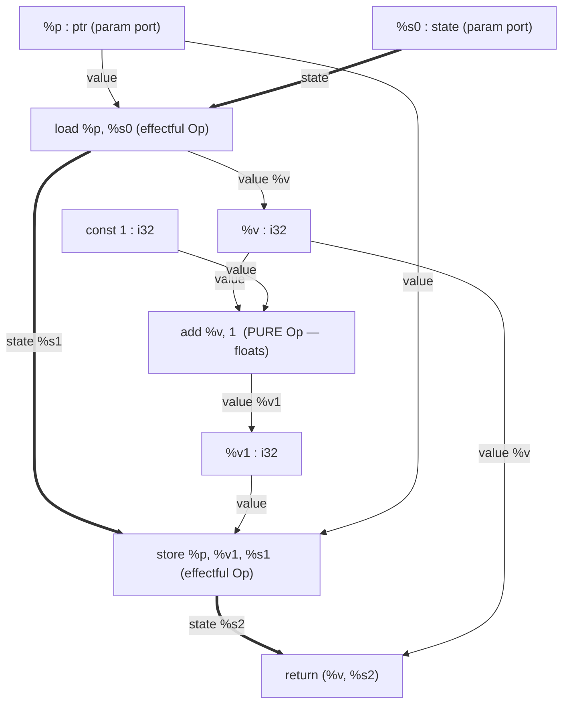

# Helix Core Model

*The formal spine: six node forms, two edge strands, region ports as block parameters, and the four structural invariants that hold by construction.*

This page is the authoritative definition of the Helix graph. Every other page
builds on the vocabulary fixed here. Helix is **one acyclic hash-consed SSA
graph** in which optimization, comptime evaluation, instruction selection, and
lowering are all the same rewrite process (see [Overview](00-overview.md) and
[Design Rationale](10-design-rationale.md)). This page nails down *what the graph
is* before any page describes *what we do to it*.

The whole model rests on two ideas that recur on every line below:

1. **Two strands.** Every edge is either a **value** edge (pure, floats) or a
   **state** edge (a linear effect token, pinned and ordered). There are no other
   edge kinds. (DC3, DC4.)
2. **Six forms.** Every node is one of exactly six forms: `Const`, `Op`, `Cond`,
   `Loop`, `Func`, `Module`. Nothing else. (DC17.)

---

## 1. The two strands

A Helix edge carries a value of some Helix type. The *kind* of an edge is
determined entirely by whether that type is the distinguished `state` type.

| Strand | Carries | Multiplicity | Placement | Implements |
|---|---|---|---|---|
| **Value** (pure) | any non-`state` value | **fan-out**: one origin, many users (duplicable) | **floats** — placed only at scheduling time | pure data dependence |
| **State** (effect) | a `state` token | **linear**: one origin, **exactly one** user | **pinned & ordered** — fixed sequence | the side-effect skeleton |

The value strand is the pure-dataflow DAG: a value *is* its defining node, edges
run use→def, and any value may be read by any number of consumers. Pure nodes
have no location of their own; the scheduler places them later (see
[Codegen](17-codegen.md), step 3).

The state strand is a **linear effect skeleton**. A `state` token is threaded
through the program: an effectful operation consumes the incoming token and
produces a fresh one, and *every* token is consumed exactly once. The chain of
state tokens *is* the program's observable-effect order. This is the proven
"pure floats / effects pinned" hybrid (Cranelift's side-effect skeleton, PEG's
σ-summaries) made the **native** model rather than a retrofit (DC3, D2), and it
directly answers failure mode 2 (effect-ordering ambiguity) and failure mode 11
(effects can't be floated freely): effect order is explicit, typed, and
fine-grained data in the graph.

**Purity is exactly the absence of a state edge.** An `Op` with no state operand
and no state result is pure: it floats, it is hash-consed, it is freely
duplicable and foldable. An `Op` *with* a state operand and a state result is
effectful: it is pinned into the skeleton. There is no separate "pure" flag — the
strand membership *is* the property. This makes purity a structural fact, not an
annotation that can drift.

### Multiple fine-grained state tokens

There is not one global state. Helix supports **multiple independent state
tokens from day one** (DC4, D4), one per alias class / region / effect family
(e.g. a memory state, an I/O state, distinct states for provably non-aliasing
regions). Two effects on different tokens are *representationally independent* —
the graph itself says they may be reordered. This is the lever for optimizing
*better*, and it is the explicit fix for RVSDG/jlm's regret of collapsing to a
single memory state (failure mode 9). Honest caveat: the payoff is gated on an
alias analysis precise enough to populate many tokens without blowup; without it
we inherit the conservative single-state trap (**R4**).

Linearity (each token used exactly once) is **enforced structurally** (DC4),
closing MimIR's admitted unenforced-linearity hole. See
[Types & Effects](13-types-and-effects.md) for the typing rules and the
linearity checker.

---

## 2. The six node forms

Helix nodes split into two families by mutability — the immutable/structural vs
mutable/nominal split borrowed from MimIR (DC8):

- **Structural nodes** (`Const`, `Op`) are pure, immutable, hash-consed, and
  belong to the value strand. They form a DAG and **float**. Structural equality
  is pointer equality (see invariant H).
- **Nominal / region nodes** (`Cond`, `Loop`, `Func`, `Module`) are mutable, they
  introduce **binders** (their region **ports**), and each **hosts one or more
  sub-graphs** (regions). "Introduces a variable ⇒ nominal/mutable" is the
  invariant.

Region **ports are block parameters** — Helix has **no phi nodes anywhere** (DC5).
A port is a named, typed entry/exit of a region; the binder a port introduces is
an ordinary value origin inside the region.

### 2.1 `Const` — literals AND types

`Const` is a structural leaf. It covers **both** ordinary literals **and types**,
because **types are ordinary values** in Helix (shallow — *not* full dependent
types; see §5). One form covers `42`, the integer type `i32`, and a function type.

```
Const := const <payload> : <type>
```

| Field | Meaning |
|---|---|
| `payload` | the literal (an integer, a type descriptor, a function type, …) |
| `type` | the type of this constant — itself a value, often another `Const` |

```
; a type is a value produced by a Const
%i32 = ty.int 32          ; Const whose payload is "the 32-bit int type"
%c42 = const 42 : i32     ; Const literal, typed by the value %i32
%fnty = ty.func (i32, i32) -> i32   ; Const: a function type
```

Because `Const` nodes are structural, two textually identical constants are the
*same* node (hash-consing). Types being values is what lets the **same** reduction
engine do type-level computation and value-level folding with no second mechanism
(DC9); it is deliberately *shallow* to avoid MimIR's divergent-type-checking risk
(**R2**, see §5).

### 2.2 `Op` — a primitive (or, after lowering, a target) operation

`Op` is the workhorse structural node: an opcode plus operand edges, with an
**optional** state-in / state-out pair.

```
Op := <result>* = <opcode> <value-operand>* [ , <state-in> ]   ; produces <state-out>?
```

| Field | Meaning |
|---|---|
| `opcode` | the primitive: `add`, `mul`, `cmp.lt`, `select`, address calc, `load`, `store`, … and **after lowering**, target-ISA opcodes such as `x64.lea` |
| value operands | edges on the **value strand** |
| state-in (optional) | one edge on the **state strand**; presence ⇒ effectful |
| state-out (optional) | a fresh `state` result; present iff state-in is present |

An `Op` with no state edge is **pure** and floats. An `Op` with a `(state-in,
state-out)` pair is **effectful** and is pinned into the skeleton:

```
; pure Op — floats, hash-consed, foldable
%r = add %x, %y                      : i32

; effectful Op — consumes %s0, produces %s1; pinned in the state strand
(%v, %s1) = load %p, %s0             ; load reads memory: it is effectful
%s2       = store %p, %v1, %s1       ; store: consumes %s1, yields %s2
```

The single `Op` form unifies arithmetic, comparison, `select`, address
arithmetic, memory access, and — crucially — **target machine opcodes after
lowering**. Lowering does not move to a second IR; it rewrites portable `Op`s into
target `Op`s *in the same graph* (DC13, see [Codegen](17-codegen.md)). This is the
"no secondary IR at the back end" guarantee.

### 2.3 `Cond` — symmetric conditional / switch (the gamma)

`Cond` is the RVSDG **gamma (γ)**: a symmetric split/join conditional or switch
with no fall-through. It hosts **k+1 branch regions** that all share the same
input ports and all produce the same result ports.

```
Cond := <result-ports> = cond <predicate> -> (<result-types>) {
          case <i>: { <region body> ; yield <values> }
          ...
        }
```

| Field | Meaning |
|---|---|
| `predicate` | a value selecting the active region (`0..k`) |
| input ports | values entering every branch region (shared) — block parameters |
| result ports | values leaving the chosen region — block parameters, **not phis** |
| regions | one sub-graph per case; identical port signatures |

```
func @absdiff(%a: i32, %b: i32) -> i32 {
  %p = cmp.lt %a, %b
  %r = cond %p -> (i32) {            ; results are PORTS (block params), no phi
    case 1: { %t = sub %b, %a  yield %t }
    case 0: { %u = sub %a, %b  yield %u }
  }
  return %r
}
```

Branches share entry ports and produce identical result ports — the join is the
result ports themselves, so there is nowhere a phi could live. If/`switch`
without fall-through both map here (see §6).

### 2.4 `Loop` — tail-controlled loop (the theta)

`Loop` is the RVSDG **theta (θ)**: a single tail-controlled (do-while) loop body
expressed **without any graph cycle**. Loop-carried values are **ports**.

```
Loop := <result-ports> = loop ( <port> = <init> )* : <types> {
          <region body>
          break unless <cond> -> <yield-on-exit>   ; or: break if ...
          continue ( <next-port-values> )
        }
```

| Field | Meaning |
|---|---|
| init values | the initial values of the loop-carried ports (entered once) |
| ports | loop-carried block parameters: live across iterations |
| `break unless`/`break if` | the tail test; on exit, routes ports to results |
| `continue (…)` | routes the iteration's results back to the ports |

```
func @sum(%n: i32) -> i32 {
  %r = loop (%acc = 0, %i = 0) : i32 {   ; acyclic region; carried values are PORTS
    %c = cmp.lt %i, %n
    break unless %c -> %acc
    %acc1 = add %acc, %i
    %i1   = add %i, 1
    continue (%acc1, %i1)
  }
  return %r
}
```

The body always evaluates fully before the next iteration is decided (tail
control), giving well-defined behaviour for loops that mutate external state via
the state strand. `while`/`for` are *compositions* of `Loop` (and `Cond` for an
entry guard), not separate forms (§6, DC6). The acyclicity argument is §7.

### 2.5 `Func` — function / closure (the lambda)

`Func` is the RVSDG **lambda (λ)**: a function or closure. It has **parameter
ports**, **result ports**, and an **optional state in/out** pair (a function that
performs effects threads a state token through its signature; a *pure* function
has none).

```
Func := func @name ( <param-port>* [ , <state-in> ] ) -> ( <result-types> [ , state ] ) {
          <region body>
          return ( <values> [ , <state-out> ] )
        }
```

| Field | Meaning |
|---|---|
| parameter ports | the formals — block parameters of the body region |
| state-in (optional) | incoming state token if the function is effectful |
| result ports | the returned values |
| state-out (optional) | outgoing state token; present iff state-in is present |
| captures | free values referenced by the body (closure environment) |

```
; pure function: no state in its signature
func @add(%x: i32, %y: i32) -> i32 {
  %r = add %x, %y
  return %r
}

; effectful function: state token threaded linearly through the signature
func @bump(%p: ptr, %s0: state) -> (i32, state) {
  (%v, %s1) = load %p, %s0
  %v1 = add %v, 1
  %s2 = store %p, %v1, %s1
  return (%v, %s2)
}
```

A call is an `Op` (`call`) consuming a `Func` value plus arguments (and the
current state token if the callee is effectful). Closures are `Func` nodes with
captured free values; closure elimination is a graph rewrite, not a separate IR
stage.

### 2.6 `Module` — translation unit (the omega/delta + recursion groups)

`Module` is the RVSDG **omega (ω)** combined with **delta (δ)** globals and the
**phi (φ)** recursion-group role. It is the top-level node: it holds the
translation unit's functions, globals, and **recursion groups**. **Recursion is
expressed here, as a named group of mutually-referring `Func`s — NOT as a graph
cycle** (DC7, §7).

```
Module := module name {
            <global>*          ; named constants / data
            <func>*            ; top-level functions
            rec { <func>+ }    ; a mutual-recursion group (binders visible to each other)
          }
```

| Field | Meaning |
|---|---|
| globals | top-level data/constants (the delta role) |
| funcs | top-level functions exported / internal |
| `rec { … }` | a recursion group: the member names are in scope inside each member, so mutual recursion is a *binding-structure* fact, not a back-edge |

```
module demo {
  rec {
    func @even(%n: i32) -> i1 { ... %r = call @odd, %m ... return %r }
    func @odd (%n: i32) -> i1 { ... %r = call @even, %m ... return %r }
  }
}
```

The `rec` group introduces the binders `@even`/`@odd` once; each member *uses*
those binders. The use→def edge from `@even`'s body to `@odd` is an ordinary value
edge to a binder — there is no cycle in the node graph (§7).

### Summary table

| # | Form | Family | Strand role | Hosts regions? | Ports / binders | RVSDG analogue |
|---|---|---|---|---|---|---|
| 1 | `Const` | structural | value (pure leaf) | no | — | constant |
| 2 | `Op` | structural | value, **or** value+state if effectful | no | — | simple node |
| 3 | `Cond` | nominal | value & state through ports | yes (k+1) | shared in-ports, shared result-ports | γ gamma |
| 4 | `Loop` | nominal | value & state through ports | yes (1) | loop-carried ports | θ theta |
| 5 | `Func` | nominal | value & state through ports | yes (1) | param-ports, result-ports, opt. state | λ lambda |
| 6 | `Module` | nominal | top-level scope | yes (1) | global/func binders, `rec` groups | ω omega + δ + φ |

---

## 3. Abstract syntax (BNF-like)

The following grammar describes a *well-formed* Helix graph. It is an abstract
syntax over interned nodes; the concrete textual form (canonicalised in
[Format](12-format.md)) is a rendering of it.

```bnf
Module    ::= "module" Name "{" Toplevel* "}"
Toplevel  ::= Global | Func | RecGroup
RecGroup  ::= "rec" "{" Func+ "}"
Global    ::= "global" "@"Name "=" Const

Func      ::= "func" "@"Name "(" Port* StateIn? ")" "->" "(" Type* StateTy? ")"
              Region "return" "(" Operand* StateOut? ")"

Region    ::= "{" Binding* "}"                       ; a hosted sub-graph
Binding   ::= ValueDef | EffectDef | RegionNode
ValueDef  ::= LHS  "=" Opcode Operand*               ; pure Op  (value strand only)
EffectDef ::= LHS "," SVar "=" Opcode Operand* "," SVar   ; effectful Op (+ state)

RegionNode::= Cond | Loop                            ; nominal nodes inside a region
Cond      ::= Ports "=" "cond" Operand "->" "(" Type* ")"
              "{" ("case" Int ":" "{" Region "yield" Operand* "}")+ "}"
Loop      ::= Ports "=" "loop" "(" (Port "=" Operand)* ")" ":" Type*
              "{" Region BreakStmt Operand* ContStmt "}"
BreakStmt ::= ("break" "unless" | "break" "if") Operand "->" Operand*
ContStmt  ::= "continue" "(" Operand* ")"

Const     ::= "const" Payload ":" Type | TypeCtor
TypeCtor  ::= "ty.int" Int | "ty.func" "(" Type* ")" "->" Type | "ty.ptr" | "state" | ...
Opcode    ::= "add" | "sub" | "mul" | "shl" | "cmp.lt" | "select"
            | "load" | "store" | "call" | TargetOp
TargetOp  ::= "x64.lea" | "x64.add" | ...            ; appears only after lowering

Operand   ::= "%"Name | Const                        ; a value edge (use -> def)
Port      ::= "%"Name ":" Type                        ; a binder = block parameter
Ports     ::= "(" "%"Name ("," "%"Name)* ")"
LHS       ::= "%"Name | "(" "%"Name ("," "%"Name)* ")"
SVar      ::= "%"Name        ; a state token (type `state`), used exactly once
StateIn   ::= "," "%"Name ":" "state"
StateOut  ::= "," "%"Name
Type      ::= "%"Name | TypeCtor                       ; types are values
```

Two abstract-syntax facts worth stating explicitly:

- An `Operand` is a **use→def edge**: it names the value's defining node. There is
  no separate "instruction reference" — a value *is* its node (DC2).
- `SVar` tokens have type `state`. Each appears as an `EffectDef`'s state-out
  exactly once and is consumed exactly once. The grammar permits, but the linearity
  invariant (below, checked by [Types & Effects](13-types-and-effects.md)) forbids,
  dropping or duplicating a token.

---

## 4. The four structural invariants (and why each holds *by construction*)

These are hard invariants. They are not maintained by passes; they are true by the
way nodes are built.

### Invariant A — Acyclic (DC7)

**Statement.** The node graph is a DAG. Loops and recursion are expressed by
`Loop` and `Module` (`rec`) region nodes; there are **no back-edges**, ever.

**Why by construction.** No constructor produces an edge from a node to one of its
own (transitive) operands. Iteration lives *inside* a `Loop` region as a `continue`
that routes values to the region's own ports — the port is a binder local to the
region, so "next iteration" is not a graph edge back to a previous value.
Recursion lives in a `Module` `rec` group where members reference shared binders;
those references are edges to binders, not cycles among value nodes (§7). Cycles
are exactly what defeat optimal extraction and complicate traversal/scheduling
(failure mode 4/5), so forbidding them is load-bearing for Tier-2 extraction
([Reduction Engine](14-reduction-engine.md)).

### Invariant B — Strict SSA by construction (DC2)

**Statement.** Every value edge is **single-origin** (use→def): a value *is* its
defining node. No SSA-restoration pass is ever needed.

**Why by construction.** There is no mutable storage cell in the model to assign
twice. The only way to "name" a value is to point an operand edge at the node that
defines it. Block parameters (ports) are the *only* merge mechanism, and a port is
itself a single defining origin within its region. RVSDG's "every input/result is
the user of exactly one edge" is precisely what made it always-SSA and erased 14
LLVM SSA-restoration passes; Helix inherits this and additionally has **no phis**
(DC5) to keep in canonical position.

### Invariant C — Hash-consed structural nodes (DC8)

**Statement.** `Const` and `Op` nodes are **interned**: structural equality ==
pointer equality == automatic GVN/CSE.

**Why by construction.** The `World` factory (see
[Reduction Engine](14-reduction-engine.md), Tier 1) is the *only* way to create a
node. Before allocating, it canonicalises (oriented rewrites to local fixpoint)
and looks the result up in the intern table; an existing structurally-equal node
is returned instead. So building `add %x %y` twice yields the *same* node — value
numbering is free, with no worklist sweep (failure mode 7: avoids V8-style cache
thrash). **Caveat:** the pointer-equality fast path is valid only for **closed
terms** (no free region binders). Open terms — fragments mentioning a port still in
scope — are compared structurally, not by pointer (this is MimIR's α-equality
caveat carried forward).

### Invariant D — Linear state (DC4)

**Statement.** Each `state` token is consumed **exactly once**. Multiple
independent fine-grained tokens (per alias class / region) exist from day one.

**Why by construction / by checking.** Effectful `Op`s consume one token and
produce one token; `Cond`/`Loop`/`Func` thread tokens through ports. The grammar
plus a linearity check (a structural use-count on `state`-typed edges:
fan-out is forbidden, drop is forbidden) reject any graph that duplicates or
discards a token. This *enforces* the linearity that MimIR left unenforced, and the
"exactly one user" rule is what makes the state strand a genuine total order per
token — i.e. the inspectable effect skeleton (DC3, answering failure modes 2
and 11).

---

## 5. Types as values (shallow, not dependent)

Types in Helix are ordinary values, produced by `Const`/type-constructor nodes and
consumed wherever a type is needed (the `: type` annotation on a value def is just
an operand pointing at a type value).

```
%i32  = ty.int 32                 ; the i32 type, a value
%ptr  = ty.ptr                    ; the pointer type, a value
%fnty = ty.func (i32, i32) -> i32 ; a function type, a value
%c    = const 42 : i32            ; 42, typed by the value %i32
```

This buys two things with one mechanism:

- **One reduction engine for type-level and value-level computation.** Because a
  type is a value, the Tier-1 normaliser folds `ty.int (add 16 16)` to `ty.int 32`
  with the *same* rules it uses on ordinary arithmetic (DC9). Comptime type
  computation is not a separate type-level interpreter.
- **`Const` covers literals and types uniformly**, keeping the taxonomy at six
  forms (DC17).

**Deliberately shallow — NOT full dependent types.** A type may *be computed* by
reduction, but Helix does **not** adopt MimIR's dependently-typed PTS where terms,
types, and kinds are one expression category checked by normalization. We keep
partial evaluation and type-as-value, and *drop* the PTS (D5). The reason is
honest risk management: MimIR's type checker can **diverge** under a bad filter
(**R2**), because deciding type equality there *is* running the (Turing-complete)
reduction engine. By keeping types shallow — first-order type descriptors, not
arbitrary dependent indexing — type checking does not become an unbounded
reduction. See [Types & Effects](13-types-and-effects.md) for the exact type
grammar and [Comptime](15-comptime.md) for the fuel-bounded reduction that *does*
run when a type is computed.

---

## 6. Mapping classic constructs to the six forms

Every familiar construct is a *composition* of the six forms — there are no
special cases bolted on (DC1, DC6).

| Source construct | Maps to | Notes |
|---|---|---|
| `if` / `if-else` | `Cond` (k=1) | result ports replace the phi at the join |
| `switch` (no fall-through) | `Cond` (k≥1) | predicate selects the case region |
| `cond ? a : b` | pure `Op select` | no region needed; it floats |
| `while` | `Cond` guard wrapping a `Loop` | entry guard + tail-controlled body |
| `for` | `Cond` guard + `Loop` | init in `loop (...)`, step in `continue` |
| `do { } while` | `Loop` directly | the native tail-controlled form |
| `break` / `continue` | `Loop`'s `break …`/`continue …` | structured, not jumps |
| function / method | `Func` | params/results are ports |
| closure / lambda | `Func` with captures | captures are ordinary value edges |
| call | `Op call` | consumes the `Func` value (+ state if effectful) |
| local mutation, I/O | state-strand threading | each write threads a new token |
| global variable | `Module` global | the delta role |
| (mutual) recursion | `Module` `rec { … }` | binders, not back-edges |
| translation unit | `Module` | the omega role |

`while (cond) body` desugars to a guarded loop — a `Cond` testing `cond` once on
entry around a `Loop` whose tail test re-checks `cond` — keeping the single
tail-controlled loop form canonical (DC6). Expressing richer control as
compositions is what guarantees a unique legal schedule exists
([Codegen](17-codegen.md)).

### A worked graph: `@bump` with both strands

Consider `@bump` from §2.5 — read a counter, increment it, store it back, return
the old value. The diagram distinguishes the **value strand** (solid `--->`) from
the **state strand** (dashed `===>`, linear). Note how the pure `add` floats off
to the side while the `load`/`store` are pinned in the state chain.



The key reading: `add` is on the value strand only, so it **floats** — purity is
"no state edge" (§1). The `load` and `store` sit on the **state strand**, each
consuming one token and producing the next, so their order is fixed by the chain
`%s0 ‖→ %s1 ‖→ %s2`. The returned `%v` is the loaded value (a value edge from
`load`), *not* the post-increment value — exactly the program's semantics, made
unambiguous by the strands.

---

## 7. The acyclicity argument for loops and recursion

Acyclicity (Invariant A, DC7) is the one invariant that looks like it *should* be
violated — programs have loops and recursion, which are "circular." The resolution
is that the circularity lives in **region/binder structure**, never in the node
graph.

### Loops: `Loop` ports, not back-edges

In a CFG or a sea-of-nodes graph, a loop induces a back-edge: the increment's
output feeds the phi at the loop header, which is "above" it. Helix has no
back-edge. Instead:

- The `Loop` node hosts **one** region. The loop-carried values are **ports**
  (block parameters) of that region — fresh binders, initialised once by the
  `loop (%acc = 0, %i = 0)` clause.
- Inside the body, `%acc1`, `%i1` are *new* values computed from the ports.
- `continue (%acc1, %i1)` does **not** draw an edge from `%acc1` back up to `%acc`.
  It is a *region result* that the `Loop` node's semantics route to the ports for
  the next iteration. The body is a finite acyclic DAG; "iterate" is the meaning of
  the `Loop` node, not an edge.

So a `Loop` body, read as a graph, is acyclic: ports → body computation → results.
The cyclic *behaviour* is the `Loop` node's evaluation rule, exactly as RVSDG's
**theta (θ)** routes its first-result-predicate back to its arguments without any
graph cycle.

### Recursion: `Module` `rec`, not back-edges

A recursive `@even`/`@odd` pair (§2.6) seems to need `@even`'s body to point at
`@odd` and vice versa — a cycle. It does not, because the `rec` group introduces
the **binders** `@even` and `@odd` once, and the bodies reference those binders.
The reference is a use→def value edge to a *binder*, and binders sit at the group
boundary, not inside another function's value DAG. This is RVSDG's **phi (φ)**
recursion-environment trick: recursion is a property of the binding environment,
not a back-edge among computations.

### Why Helix is simpler than RVSDG here

RVSDG expresses the same idea with **five distinct structural node kinds** for the
inter/intra-procedural levels — γ, θ, λ, δ, φ, ω — plus entry/exit/loop/context/
recursion *variable* formalisms for each. Helix folds the same expressive power
into **four** region forms by:

- **Collapsing ω + δ + φ into one `Module`.** The translation unit, its globals,
  and its recursion groups are facets of "the top-level scope," so they are one
  nominal node with a `rec { … }` sub-form rather than three node kinds. (This is
  the DC17 minimality lever; MimIR similarly argues "fewer syntactic categories ⇒
  fewer patterns.")
- **Keeping γ and θ as `Cond` and `Loop`** essentially unchanged, because those two
  carry their weight: a symmetric join (no phis) and a single canonical
  tail-controlled loop (unique legal schedule, DC6).
- **Not paying RVSDG's round-trip.** RVSDG's acyclicity is wonderful internally but
  its construction *and* destruction dominate jlm's codebase (the LLVM↔RVSDG bridge
  is ~6× the IR core; failure mode 1). Helix is acyclic *and* parses directly into
  the graph and emits machine code directly out of it (DC12/DC13), so the
  acyclic form is the *only* form — there is no second representation to convert to.

**Honest limitation.** Forbidding cycles does not make irreducible control flow
free: like RVSDG, an irreducible CFG from a frontend must be *restructured* into
`Cond`/`Loop` form on the way in (see [Frontend](18-frontend.md)), which can
introduce auxiliary predicates. We keep the acyclic invariant; we pay for
irreducibility at construction, not with back-edges. And owning the whole path from
acyclic graph to bytes means owning NP-hard backend problems — output quality lags
LLVM until mature (**R3**, see [Codegen](17-codegen.md)).

---

## 8. What this enables (forward pointers)

Because the model is fixed as above, the rest of the wiki gets to assume it:

- **Free GVN/CSE** from hash-consing (Invariant C) and **structural LICM/DCE** from
  the form itself, without equality saturation — the structural-wins thesis (D7),
  detailed in [Optimizations](16-optimizations.md).
- **Comptime = Tier-1 reduction** over this graph (types-as-values, §5), in
  [Comptime](15-comptime.md).
- **Direct, in-place lowering**: portable `Op`s rewritten to target `Op`s, tiling up
  the pure value strand and stopping at port/state boundaries, scheduling read off
  the state strand — [Codegen](17-codegen.md).
- **One rule DSL** (`=>` Tier 1, `~` Tier 2, `lower … @cost`) shared by peepholes,
  comptime folds, and instruction selection — [Reduction Engine](14-reduction-engine.md).

---

## See also

- [00 Overview](00-overview.md) — the one-graph, one-reduction thesis.
- [10 Design Rationale](10-design-rationale.md) — why these six forms and two strands (DC/D/R mapping).
- [12 Format](12-format.md) — the canonical printable/diffable textual syntax used in every example here.
- [13 Types and Effects](13-types-and-effects.md) — the type grammar, the `state` type, and the linearity checker (Invariant D).
- [14 Reduction Engine](14-reduction-engine.md) — the `World` factory, Tier-1 normalization (Invariant C), and Tier-2 overlay.
- [15 Comptime](15-comptime.md) — comptime as reduction over this graph; NbE and neutral terms.
- [16 Optimizations](16-optimizations.md) — structural GVN/LICM/DCE emergent from the model.
- [17 Codegen](17-codegen.md) — direct lowering, scheduling off the state strand, SSA register allocation.
- [18 Frontend](18-frontend.md) — parsing imperative source directly into Cond/Loop/Func/Module.
- [21 Worked Examples](21-worked-examples.md) — larger end-to-end graphs.
- [22 Risks and Open Problems](22-risks-and-open-problems.md) — R1–R7 in depth.
- [23 Glossary](23-glossary.md) — strand, port, token, region, hash-consing.
- [research/00-synthesis.md](research/00-synthesis.md) — the DC/D/R/failure-mode source.
- [research/02-rvsdg.md](research/02-rvsdg.md) — gamma/theta/lambda/delta/phi/omega in depth.
