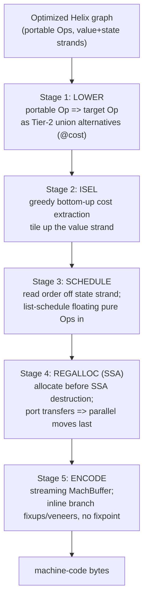

# Direct Code Generation

*The Helix backend lowers, schedules, allocates, and encodes on the SAME acyclic graph — graph straight to bytes, no secondary backend IR (DC13, D1). Existence proof: Cranelift VCode + regalloc2 + MachBuffer.*

This page specifies the entire path from an optimized Helix graph to machine-code bytes. There is
**no second IR** at the backend boundary: lowering rewrites portable `Op` nodes into target-ISA
`Op` nodes *in the same graph* (recorded as Tier-2 alternatives), instruction selection is a
greedy bottom-up cost extraction over those alternatives, scheduling is read off the **state
strand**, register allocation runs on SSA *before* destruction, and a streaming encoder emits
bytes with inline branch fixups. Every step traces to a design constraint (DC13/DC15), a
differentiator (D1/D2), or an honest risk (R3).

This is the riskiest part of Helix. Owning instruction selection, scheduling, AND register
allocation means owning a cluster of NP-hard / NP-complete problems (R3). We do **not** claim to
beat LLVM -O3 output quality; we claim a single-IR backend that is dramatically smaller code and,
when mature, competitive — and that ships today's proven pieces (Cranelift's whole pipeline `[08]`)
rather than inventing new ones.

---

## 0. Where the backend begins

The backend consumes the *same* graph the optimizer produced (see [Optimizations](16-optimizations.md)
and [Reduction Engine](14-reduction-engine.md)). Recall the invariants from [Core Model](11-core-model.md):

- The graph is an **acyclic** DAG (DC7); loops/recursion live in `Loop`/`Module` region nodes,
  never as back-edges.
- Every value edge is **single-origin** SSA by construction (DC2) — no SSA-restoration ever.
- **Two strands**: pure `Op`/`Const` nodes ride the *value strand* and FLOAT (no fixed position);
  effectful ops thread the *state strand* — a linear (used-exactly-once) state token that PINS
  and ORDERS them. This pure-floats / effects-pinned hybrid (DC3, D2) is the native model, so the
  effectful common case is already as inspectable and ordered as a CFG. Helix never "collapses to
  a CFG" the way Sea-of-Nodes did under pervasive effects (synthesis failure mode 3) `[01][06]`.
- Region **PORTS** are block parameters (DC5) — there are **no phi nodes anywhere**.

The five backend stages, all on this one graph:



No box in that diagram is a separate IR. Stages 1–4 mutate node *attributes* (selected tile,
assigned register, schedule index) on the existing nodes; only Stage 5 produces a byte array.

---

## 1. Stage 1 — Lowering rules (portable `Op` => target `Op`)

Lowering is **rewriting**, expressed in the one rule DSL shared by peepholes, comptime folds, and
instruction selection (DC14). A `lower` rule rewrites a portable-`Op` pattern into a target-ISA
`Op` (e.g. `x64.lea`), carrying a machine **`@cost`** and an optional `if` guard. Crucially, a
`lower` rule does **not** destructively replace the portable node: it records the target form as a
**Tier-2 equivalence alternative** in the acyclic, append-only overlay (a *union node*), exactly
as the equivalence overlay does for `~` rules (see [Reduction Engine](14-reduction-engine.md)).
This is why ISel is *deferred* to Stage 2: multiple legal tilings coexist as alternatives until a
cost extraction picks one.

> Why an overlay and not eager `=>`? Because lowering choices are the canonical case of "no single
> best form" (Tier-2's whole reason to exist). `add b (mul i s)` could become two ops or one
> `lea`; which wins depends on surrounding cost, so we record both and let extraction decide.
> Tier-1 eager normalization (DC8) still ran earlier and gave us GVN/fold/CSE for free; Tier-2 is
> bounded, greedy, acyclic — NOT equality saturation (D7) `[05][08]`.

### Example lowering rules — an x86-64 subset

Canonical rule-DSL syntax (`lower NAME : LHS => RHS @cost N if GUARD`):

```
; address arithmetic -> LEA (the classic many-to-one tile)
lower lea-bis : (add ?b (mul ?i (const i64 ?s)))            => (x64.lea ?b ?i ?s (const i64 0)) @cost 1 if member(?s, {1,2,4,8})
lower lea-bisd: (add (add ?b (mul ?i (const i64 ?s))) (const i64 ?d))
                                                            => (x64.lea ?b ?i ?s (const i64 ?d)) @cost 1 if member(?s, {1,2,4,8})
lower lea-add : (add ?x ?y)                                 => (x64.lea ?x ?y (const i64 1) (const i64 0)) @cost 1   ; 3-operand add via lea (no flags clobber)

; plain register add (clobbers flags) — cheaper encoding, competes with lea-add
lower add-rr  : (add ?x ?y)                                 => (x64.add ?x ?y) @cost 1

; fold an immediate into the add tile
lower add-ri  : (add ?x (const i32 ?k))                     => (x64.add.ri ?x ?k) @cost 1 if fits_imm32(?k)

; multiply-add is NOT a single x86 op: it stays two tiles (contrast aarch64 madd below)
lower mul-rr  : (mul ?x ?y)                                 => (x64.imul ?x ?y) @cost 3

; loads/stores — EFFECTFUL: the state token threads THROUGH the tile unchanged
lower load    : (load ?addr ?s)                            => (x64.mov.load ?addr ?s) @cost 4
lower load-m  : (load (add ?b (mul ?i (const i64 ?sc))) ?s) => (x64.mov.load.bis ?b ?i ?sc ?s) @cost 4 if member(?sc,{1,2,4,8})   ; folds address calc into the memory operand
lower store   : (store ?addr ?v ?s)                        => (x64.mov.store ?addr ?v ?s) @cost 4

; compare + conditional branch off a Cond region's predicate port
lower cmp     : (cmp.lt ?x ?y)                             => (x64.cmp ?x ?y) @cost 1
lower br-lt   : (cond (cmp.lt ?x ?y) ?t ?f)               => (x64.jl ?t ?f (x64.cmp ?x ?y)) @cost 1
```

### Example lowering rules — an aarch64 subset (shows a genuine many-to-one fusion)

```
lower madd    : (add ?a (mul ?x ?y))                       => (a64.madd ?x ?y ?a) @cost 1     ; one instruction for a + x*y
lower add-rr  : (add ?x ?y)                                => (a64.add ?x ?y) @cost 1
lower add-lsl : (add ?x (shl ?y (const i64 ?sh)))         => (a64.add.lsl ?x ?y ?sh) @cost 1 if le(?sh, 4)   ; shifted-register add
lower ldr     : (load ?addr ?s)                           => (a64.ldr ?addr ?s) @cost 4
lower ldr-idx : (load (add ?b (mul ?i (const i64 ?sc))) ?s) => (a64.ldr.reg ?b ?i ?sc ?s) @cost 4 if member(?sc,{1,2,4,8})
lower str     : (store ?addr ?v ?s)                       => (a64.str ?addr ?v ?s) @cost 4
lower cbz     : (cond (cmp.eq ?x (const _ 0)) ?t ?f)      => (a64.cbz ?x ?t ?f) @cost 1
```

These rules are SMT-verifiable in the VeriISLE style (DC14) `[05][08]`: each `lower` rule asserts
the target `Op` is semantically equal to the portable LHS, so the rule table can be machine-checked
for soundness — directly attacking the Alive-found "2.4% of hand-written transforms are buggy"
problem `[06]`. The same overlap/priority checker that guards `=>` rules guards `lower` rules; two
overlapping tiles must differ in priority or be flagged.

**Effectful tiles thread state, never float it.** Notice `load`/`store` rules carry `?s` (the state
token) straight through. A tile may *consume* pure producers (address arithmetic) into its memory
operand, but it can never absorb a state edge — the state strand is the pin. This is the structural
enforcement of "you cannot float a comptime/runtime side effect" `[08]` and of failure mode 11
(effects can't be rewritten freely) `[05]`.

---

## 2. Stage 2 — Instruction selection = greedy bottom-up cost extraction (tiling)

Now the overlay has, per value, a small union of alternatives (portable form + one or more target
tiles). **Instruction selection is choosing one alternative per node so total cost is minimized.**
That is exactly *extraction* from the acyclic overlay, done **greedy bottom-up (BURS / maximal-munch
style)** with dynamic-programming cost — NOT optimal ILP, NOT saturation (DC15, D7).

### Tree-matching up the value strand, stopping at strand/port boundaries

Helix tiles by **matching up the pure value strand** from a root, the way Cranelift's lowering looks
"up" to a node's producers `[08]`. A *tile* is a many-to-one pattern: it covers one root node plus
some of its pure producers, emitting one (or few) target ops. Matching **stops at**:

- a **region PORT** (block parameter of a `Cond`/`Loop`/`Func`) — ports are tree leaves; you cannot
  tile across a region boundary, just as Cranelift stops at block parameters `[08]`;
- a **state-strand edge** — effectful producers are pinned, so they are leaves of any pure match
  tree (a tile may *read* a value the effectful op produced, but the effectful op itself is its own
  tile);
- a **shared value** with more than one consumer, when absorbing it would force re-computation for
  the other consumer (the DAG-sharing hazard).

> The sharing hazard is the crux of why optimal DAG/e-graph tiling is **NP-complete** (Koes &
> Goldstein; e-graph extraction hardness) `[08]`. A tile that "absorbs" a shared subexpression
> saves an op on its own path but may force the sibling consumer to recompute or take a copy. We
> deliberately do NOT solve this optimally. We extract **greedily with a local cost function**,
> exploiting that overlay e-classes are tiny in practice (Cranelift measured avg 1.13 nodes/class)
> `[05]`. Shared pure values default to being a tile leaf (materialized once, into a register), so
> CSE/GVN done in Tier-1 is preserved rather than undone by tiling.

### The extraction algorithm

```
extract(node):                       ; memoized over the graph (each node visited once)
  if node is a region PORT:    return leaf-cost(node)        ; lives in a register
  if node is on the state strand: return state-op-cost(node) ; pinned; its pure inputs are leaves
  best = +inf
  for each alternative tile T in union(node):                ; portable + target forms
     c = T.@cost
     for each operand slot of T that recurses into a pure producer p:
        c += extract(p)              ; DP: reuse memoized sub-costs
     best = min(best, c, choosing T as node's selected tile)
  return best
```

This is **one bottom-up DP pass** (memoized; each node visited once), choosing the min-cost tile and
recording it on the node. Because the graph is a DAG and the overlay is acyclic and append-only
(DC7/DC8), the recursion always terminates and there are no overlapping subproblems across cycles —
the property that makes cyclic e-graph extraction so painful `[05]`.

**Honest limitation (R3).** A bottom-up DP cost cannot see *non-local* cost: register pressure,
scheduling slack, and shared-tile interactions all depend on global context the DP does not have
`[08]`. So Helix treats extraction as a *good heuristic, not an oracle*. Two-operand-destructive
ISAs (x86) further mean a "min-cost tile" locally can raise copy pressure globally; we accept this
known suboptimality rather than chase an NP-complete optimum.

### Tiling example (the `lea` many-to-one tile)

Given pure value-strand sub-graph `add(b, mul(i, const i64 4))`, the overlay holds (at the `add`):

| Alternative | Tile covers | Ops emitted | `@cost` |
|---|---|---|---|
| `lea-bis` | `add` + `mul` + `const` (3 nodes) | `x64.lea b, i, 4` (1) | 1 |
| `add-rr` over `imul` | `add` only | `x64.imul t,i,4` + `x64.add b,t` (2) | 1 + 3 = 4 |

Greedy bottom-up picks `lea-bis`: one instruction, cost 1, absorbing the multiply and the constant
scale into a single addressing-mode tile. If `mul(i, 4)` were *also* consumed elsewhere, the shared
hazard kicks in and extraction keeps the `imul` as its own tile (leaf), choosing `add-rr` here.

---

## 3. Stage 3 — Scheduling (read the order off the state strand)

After ISel, every node has a selected tile but pure tiles still **float** (DC3). Scheduling assigns
a total instruction order. Helix does this in two moves:

1. **Read the skeleton off the state strand.** The state strand is a *linear chain* (used exactly
   once, DC4): `s0 -> load -> s1 -> store -> s2 -> ...`. That chain **is** the program order of the
   side-effecting ops. We read it directly — no analysis, no fixpoint. Region nodes (`Cond`/`Loop`)
   nest sub-schedules; their `case`/loop-body regions are scheduled recursively and spliced at the
   region's position in the parent strand.
2. **List-schedule the floating pure tiles into the skeleton.** For each region body, run a standard
   **list scheduler** over the pure dependence sub-DAG: ready list ordered by a priority (critical-
   path length / latency), place each pure tile no earlier than its operands and (if it feeds an
   effectful op) before the state position that needs it `[08]`. Pure tiles with no live consumer in
   a region sink out of it for free (LICM/sinking emerge from *placement*, the Global-Code-Motion
   intuition, D-table `[01]`).

### Why a legal schedule ALWAYS exists and is cheap to read off

This is the property RVSDG bought with canonical structured control and that the VSDG catastrophically
lacked. Because Helix control is canonicalized to a **minimal structured set** — symmetric `Cond`
(gamma) and tail-controlled `Loop` (theta), with all loop-carried data as ports (DC6) — the state
strand within each region is a single linear chain and regions nest in a tree. A total order is
therefore obtained by: (a) topologically respecting value edges (a DAG, so a topo order exists),
and (b) following the already-linear state chain for effects. The two never conflict because pure
ops carry no state edge and effectful ops are *already* in a chain.

> **Contrast: the VSDG sequentialization disaster.** In a Value(-State) Dependence Graph without a
> committed effect order, recovering a legal linear schedule is "the major obstacle preventing
> widespread usage of the VSDG" (Upton/Lawrence) `[06]`: pick a bad order and you either duplicate
> shared nodes exponentially or compute eagerly and risk introducing non-termination (failure
> modes 2 and 4) `[06]`. V8's TurboFan hit the live version of this — its scheduler had to
> *re-duplicate* shared pure nodes onto paths and could *oscillate* (optimize 1 division, then
> re-expand to 2) `[01]`. Helix sidesteps the whole problem: **the schedule for effects is not
> recovered, it is read** — it was fixed the moment the parser threaded the state strand (DC12, see
> [Frontend](18-frontend.md)). Only *pure* tiles are placed, and pure placement is always legal by
> definition (no observable order). This is differentiator D2 cashed out at the backend.

```
; the state strand IS the effect schedule — read top-to-bottom
func @bump(%p: ptr, %s0: state) -> (i32, state) {
  (%v, %s1) = load %p, %s0          ; schedule pos 1 (effectful: consumes %s0)
  %v1 = add %v, 1                    ; pure: floats; placed after %v, before the store that needs %v1
  %s2 = store %p, %v1, %s1          ; schedule pos 2 (effectful: consumes %s1)
  return (%v, %s2)
}
```

The two effectful ops are ordered by `%s0 -> %s1 -> %s2`; `add` floats and the list scheduler drops
it between them because the store consumes its result. With **multiple independent state tokens**
(per alias class, DC4/D4), two non-aliasing effect chains schedule independently — exposing
instruction-level parallelism a single global memory state would hide (failure mode 9) `[02][06]`.
Honest caveat R4: that payoff is gated on a precise alias analysis populating the fine-grained
states; without it we degrade to one coarse state and inherit the conservative trap.

---

## 4. Stage 4 — Register allocation on SSA (before destruction)

Helix allocates registers **on the still-SSA graph, before any SSA destruction** (DC15). This is a
deliberate phase-order choice (failure mode 10): SSA interference graphs are **chordal** only in
strict SSA form; after destruction (ports -> copies) the interference graph can become non-chordal,
non-perfect, and **register allocation after SSA destruction is NP-complete** (Pereira & Palsberg,
citing Hack) `[08]`. So we allocate first, destruct last.

### Operand model handed to the allocator

Each selected target tile exposes its operands with **use/def** roles, **timing** (early = read
before the instruction executes, late = written after), and **constraints** (any register, fixed
register, stack slot, or *reused-input* for two-operand-destructive ISAs) `[08]`. This is how x86
read-modify-write (`add` reuses its dest as a source), fixed-register requirements (shift count in
`cl`, `div` using `rdx:rax`), and calling-convention clobbers are expressed to the allocator with
**no separate effect IR** — the same trick VCode uses.

### Live-range splitting / spilling sketch

We follow the production design (regalloc2 / Wimmer-Franz backtracking on SSA `[08]`) rather than
the textbook chordal-coloring algorithm, because spilling/coalescing quality and constraint handling
are what actually dominate, and production allocators ship backtracking with bundles, not MCS
coloring `[08]`:

1. Build live ranges from SSA def/use; a def dominates all its uses, so interference is checked
   cheaply at def points (the SSA simplification).
2. Group related ranges (a value and the port it flows into) into **bundles**; try to assign each
   bundle a register.
3. On conflict, **backtrack**: either evict a lower-spill-weight bundle or **split** the live range
   at a program point (introducing a move) and retry, lowering pressure to fit `Maxlive <= k`.
4. **Spill** the lowest-weight ranges to stack slots when no split fits; reload at uses.
5. **Coalesce** redundant copies last.

> Theory note (kept, not shipped): in strict SSA you *could* decouple completely — spill to reach
> `Maxlive <= k`, then color optimally in near-linear time via a simplicial (perfect-elimination)
> ordering, then coalesce `[08]`. Helix keeps this as a *checker / reference oracle* (chordality
> gives a known-good coloring to validate the backtracker against) but ships the backtracking
> allocator for real-world constraint handling.

### Resolve region-port transfers as PARALLEL MOVES — last

Because Helix has **block parameters, not phi** (DC5), a control merge or loop back-transfer is a
transfer of several values into a region's ports *simultaneously*. After registers are assigned, each
such transfer becomes a **parallel move**: a set of `dst <- src` register/stack copies executed as
if all at once. We emit them only at the very end, after allocation, resolving:

- **chains** (`a<-b, b<-c`) by ordering the copies;
- **cycles / "windmills"** (`a<-b, b<-a`) with one **scratch register** (or an `xchg`-style swap)
  to break the cycle `[08]`.

This is the single place SSA is actually destructed, and it is the locus of real-world backend
complexity — handled by a small, well-understood parallel-move algorithm rather than a phi-elimination
pass with its own SSA-restoration bugs.

---

## 5. Stage 5 — Streaming encoding to bytes (no fixpoint)

Final emission walks the scheduled, register-assigned tiles in order and streams bytes into a
**MachBuffer-style sink** `[08]`. This is not a `Vec<u8>`; it tracks emitted bytes, bound labels,
label-offset tables, label aliases, and the trailing run of branches, doing all branch work
**inline with no fixpoint** (DC13):

- **Per-tile `emit`.** Each target `Op` knows how to write its own encoding and declares its branch
  references via a label-use kind (reference width, how to patch a resolved offset, how to emit a
  veneer).
- **Tail branch peephole.** As labels bind, a linear-time pass over the trailing branches does
  branch inversion (drop a fall-through jump), jump threading via the alias table, and dead-block
  elision — replacing the classic multi-pass (critical-edge splitting, block ordering,
  redundant-block elimination, branch relaxation) with inline edits `[08]`.
- **Veneers + islands on deadlines.** For out-of-range branches, insert a **veneer** (longer-form
  indirect branch); emit **constant/branch islands** *just in time* when about to exceed range,
  tracking outstanding references and deadlines — "without any sort of fixpoint algorithm or later
  moving of code" `[08]`.

The output is the final machine-code byte array. **No secondary IR existed at any point** between
the optimized graph and these bytes (D1) — closing the secondary-IR-drift failure mode that
RVSDG->LLVM, Thorin->LLVM, and MimIR->textual-LLVM all suffered (failure mode 12) `[02][03][04]`.

---

## 6. End-to-end worked example

Source-level intent: `*p + a*4` (a load fused with an indexed address, plus an add). Helix function,
state strand threaded explicitly:

```
func @load_scaled(%p: ptr, %a: i64, %s0: state) -> (i64, state) {
  %off  = mul %a, 4                 ; pure (value strand) — floats
  %addr = add %p, %off              ; pure — floats
  (%v, %s1) = load %addr, %s0       ; effectful — pinned on state strand
  %r    = add %v, %a                ; pure — floats
  return (%r, %s1)
}
```

**Stage 1 (lower)** records target alternatives in the overlay (x86-64 subset):

| Value node | Tier-2 alternatives recorded |
|---|---|
| `load %addr` | `load-m` (fold `add`+`mul`+`const` into a `[base+idx*4]` memory operand) `@cost 4`; or `load` over a materialized `%addr` `@cost 4` |
| `add %v, %a` | `add-rr` `@cost 1`; `lea-add` `@cost 1` |
| `add %p,%off`/`mul %a,4` | absorbed by `load-m`, OR `lea-bis` `@cost 1` if materialized |

**Stage 2 (ISel, greedy bottom-up).** The address sub-graph feeds exactly one consumer (the load),
so no sharing hazard: extraction picks the **`load-m` tile**, absorbing `mul`+`add`+`const` into the
load's addressing mode (1 effectful instruction instead of `imul`+`add`+`mov` = 3). For `add %v,%a`,
`add-rr` is chosen (`%v` would otherwise need an extra `lea` copy). Chosen tiles annotated:

```
; [tile load-m]  covers: mul %a,4 + add %p,%off + load   => one x64 load with [p + a*4]
; [tile add-rr]  covers: add %v,%a                        => one x64 add
```

**Stage 3 (schedule).** State strand is `%s0 -> load -> %s1`: one effectful op, fixed. The pure
`add %v,%a` floats and is list-scheduled after the load (it consumes `%v`). Final order: load, then
add.

**Stage 4 (regalloc, SSA).** Inputs `%p,%a` arrive in argument registers (fixed-register
constraints); `%v` and `%r` get virtual regs colored to GP registers; `add-rr` is two-operand
destructive on x86, so the allocator honors the **reused-input** constraint (dest reuses a source),
inserting a copy only if `%v` is still live. No ports here, so no parallel moves.

**Stage 5 (encode).** Two tiles stream to bytes (illustrative x86-64, AT&T-ish):

```
load_scaled:
    mov    (%rdi,%rsi,4), %rax     ; [tile load-m]  load *(p + a*4)   ; %rdi=p, %rsi=a
    add    %rsi, %rax              ; [tile add-rr]  rax += a
    ret
```

Three portable pure ops + one effectful op collapsed into **two real instructions** via one
many-to-one addressing-mode tile — selected, scheduled, allocated, and encoded entirely on the one
Helix graph, no secondary IR. (Honest note: whether this exact tiling is *optimal* under register
pressure is the non-local-cost question of R3; here it plainly is, but the greedy extractor does not
*prove* optimality in general.)

---

## 7. Honest risk register (backend-specific)

| Risk | What it means for codegen | Mitigation in Helix |
|---|---|---|
| **R3** — owning ISel + schedule + RA | These are NP-hard/NP-complete (optimal DAG/e-graph tiling, combined schedule+RA); cost is non-local; output quality **lags LLVM until mature** `[08]` | Greedy extraction as heuristic not oracle; ship proven backtracking RA; one declarative SMT-checkable rule table; accept suboptimality deliberately |
| **R1** — "optimizes better, smaller code" in tension | No prior graph IR has *beaten* LLVM/GCC -O3 output `[02][05]` | We claim *matches* the best graph IRs in far less code + unified comptime/codegen; **not** beats -O3 |
| **R4** — fine-grained state needs good alias analysis | Without it, schedule/RA see one coarse state and lose the independence wins `[02]` | Multi-state from day one (DC4); alias pass writes results back as extra states; degrade gracefully to one state |
| **R5** — sea-of-nodes debuggability | A backend bug in a floating graph is hard to localize `[01][04]` | Printable/diffable/source-mapped tiles and schedule from day one (DC16, see [Tooling/Format](12-format.md)); stable semantic names |
| **R6** — float wins shrink on effect-heavy code | When most ops are effectful, little floats, so scheduling freedom is small `[01][06]` | The skeleton is already CFG-cheap; we lose *upside*, not *correctness* |

The defensible pitch for this page: a **single-IR, single-pass-flavored backend** — lower, select,
schedule, allocate, encode on the same acyclic graph with **no secondary IR (D1)** — that is
dramatically smaller than a SelectionDAG/MIR-style stack and is *proven possible* by Cranelift's
VCode + regalloc2 + MachBuffer `[08]`. It does **not** out-optimize LLVM's mature backend; it trades
peak output quality (R3) for radical simplicity and the unification that lets the *same* graph and
the *same* rule DSL serve optimization, comptime, and codegen.

---

## See also

- [Core Model](11-core-model.md) — the six node forms, two strands, ports-not-phi, acyclicity.
- [Reduction Engine](14-reduction-engine.md) — Tier-1 eager normalization vs Tier-2 bounded overlay; where `lower`/`~` rules live.
- [Optimizations](16-optimizations.md) — the optimized graph this backend consumes; structural GVN/LICM/DCE (D7).
- [Frontend](18-frontend.md) — how the state strand is threaded at parse time, so the schedule is *read* not *recovered*.
- [Types and Effects](13-types-and-effects.md) — the linear state token and fine-grained multi-state (DC4).
- [Format](12-format.md) — the canonical printable/diffable textual form used in every snippet here (DC16).
- [Worked Examples](21-worked-examples.md) — longer source-to-silicon traces.
- [Risks and Open Problems](22-risks-and-open-problems.md) — full R1..R7 register; R3 is the backend's load-bearing risk.
- [Implementation Plan](19-implementation-plan.md) — staging the backend; Cranelift pieces as the build order.
- Research grounding: [Backend / Direct Codegen](research/08-backend-direct-codegen.md), [Synthesis](research/00-synthesis.md).
