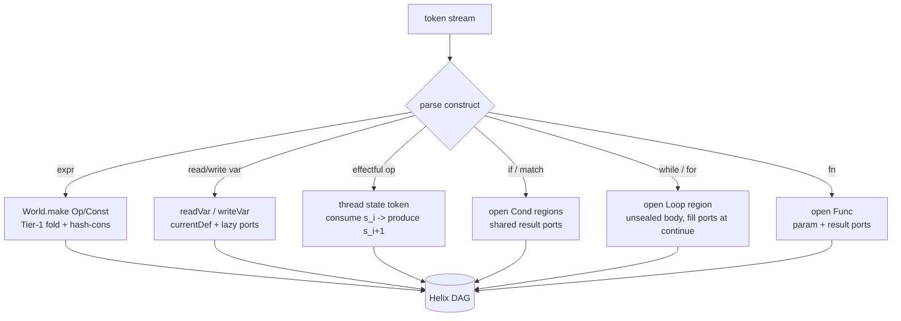

# Frontend: Parsing to the Graph

_Helix has no front-end IR and no AST→IR lowering pass: the parser builds Helix nodes
directly, doing on-the-fly SSA construction (Braun et al. 2013) and getting GVN/folding for
free as it goes. This page specifies how source becomes graph (DC12)._

---

## 1. Thesis: the parser is the IR builder

Every prior graph IR we surveyed builds the graph *after* a separate front-end produces an AST
or a front-end IR. Helix collapses that: the parser emits Helix nodes straight into the `World`
factory, in the same recursive-descent pass that recognizes the surface syntax. There is no
AST→IR translation stage to write, test, or get wrong.

This is **DC12** ("parse directly into the graph; no front-end IR"), justified by Thorin's
Impala and MimIR's Mim, both of which construct their graph directly from the AST via the
Braun-2013 SSA-construction algorithm with **no up-front dominance computation** `[03][04]`.
Helix takes the same route and adds Cranelift-style direct emission at the other end (see
[Codegen](17-codegen.md)), so the IR has **no round-trip at either boundary** (D1).

What "direct" buys, concretely:

| Eliminated stage | What it usually is | Why Helix doesn't need it |
|---|---|---|
| AST → IR lowering | A second tree-walk that re-expresses every construct | Parser builds nodes inline; one walk |
| Up-front dominance / DF | Cytron φ-placement precomputation | Braun-2013 inserts ports lazily, on demand |
| SSA construction pass | Mem2reg / reg2mem after a naive lowering | Locals never become memory; they are values from birth |
| Separate GVN/CSE pass over the new IR | A worklist over the freshly lowered IR | Hash-consing in the `World` does it at construction (DC8) |

> **Honest scope (R5).** Deleting the AST does not delete the work the AST was *also* doing for
> name resolution, type checking, and diagnostics. Those still exist; they are restructured to
> run alongside graph construction rather than over a tree. Section 9 is explicit about this.

---

## 2. The six forms are the only build targets

The parser only ever produces the six canonical Helix forms (see [Core Model](11-core-model.md)).
There is nothing else to emit:

| Surface construct | Helix form it builds | Strand |
|---|---|---|
| literal, type expression | `Const` | value |
| arithmetic / compare / call-of-primitive / address calc | `Op` | value (pure) or value+state (effectful) |
| `if` / `match` / `switch` | `Cond` (gamma) | result ports |
| `while` / `for` / `loop` | `Loop` (theta), acyclic | loop-carried ports |
| `fn` definition / closure | `Func` (lambda) | params + result ports (+ optional state) |
| file / `mod` / recursion group | `Module` (omega/delta) | top-level + recursion groups |

Block parameters (region **ports**) carry every value that, in a φ-based IR, would need a phi.
**There are no phi nodes in Helix anywhere** (DC5) — the parser inserts ports, never phis.

---

## 3. On-the-fly SSA: local value numbering + lazy ports

The construction algorithm is Braun et al. 2013, adapted to Helix's region structure. Two data
structures drive it, both *local to a region*:

1. **`currentDef[var][region]`** — the current Helix value node bound to a source variable
   within a region. This is the local value-numbering table; reading a variable is a lookup,
   writing it is an update. No memory, no `alloca`, for any variable whose address is never
   taken.
2. **Sealed/unsealed region flags** — a region is *sealed* once all of its predecessors (the
   places that supply its entry ports) are known. Lookups in an unsealed region that miss
   locally record an **incomplete port** to be filled when the region seals.

Reading a variable (`readVar`):

```
readVar(v, r):
  if v in currentDef[r]:            ; local definition — trivial
      return currentDef[r][v]
  return readVarRecursive(v, r)     ; must look through region entry ports

readVarRecursive(v, r):
  if r is unsealed:
      port = newPort(r)             ; placeholder entry port; fill on seal
      incompletePorts[r][v] = port
      result = port
  else if r has one predecessor p:
      result = readVar(v, p)        ; no port needed — forward the value
  else:                             ; Cond merge / Loop back-region
      port = newPort(r)
      writeVar(v, r, port)          ; break cycles before recursing
      result = addPortArgs(v, port) ; pull arg from each predecessor; trivial-port removal
  writeVar(v, r, result)
  return result
```

`addPortArgs` is where redundant ports are collapsed: if every predecessor supplies the *same*
value (or the port's only other operand is the port itself), the port is removed and replaced by
that value — the Braun "trivial phi" rule, restated for ports. Because the value strand is
hash-consed, "same value" is **pointer equality** (DC8), so this check is O(1).

Key properties this gives the frontend for free:

- **Strict SSA by construction** (DC2): every value edge is single-origin the instant it is
  created; no later SSA-restoration pass is ever needed.
- **GVN during parsing** (DC8/D6): two textually distinct subexpressions that compute the same
  pure value intern to the *same* node, so common-subexpression elimination happens while you
  type, not in a later sweep.
- **No dominance up front**: ports are inserted lazily where control merges, exactly the
  Braun-2013 win that lets Impala/Mim skip Cytron `[03][04]`.

---

## 4. Expressions → interned value Ops

A pure expression becomes a `Const` (leaf) or an `Op` (internal node) on the **value strand**.
Construction goes through the `World` factory, which applies Tier-1 oriented rewrite rules
(`=>`) to fixpoint *at construction time* — constant folding, algebraic identities, and CSE via
hash-consing (see [Reduction Engine](14-reduction-engine.md)). The parser therefore never emits
a node it could have folded.

```
; source:  z = (x + 0) + (x + 0)
; World.make(add %x, (const i32 0)) ; rule add-zero fires: (add ?x (const _ 0)) => ?x
                                    ; ... so no node is built; the call returns %x
; both (x + 0) sub-expressions collapse to %x, leaving:
%z  = add %x, %x              ; the outer add is built once; a second identical add would GVN to it
```

The same factory entry point serves peepholes, comptime folds, and (later) instruction
selection — **one rule DSL, DC14**. Canonical rule syntax, reused verbatim from the spine:

```
rule add-zero : (add ?x (const _ 0)) => ?x
rule fold-add : (add (const ?t ?a) (const ?t ?b)) => (const ?t {a + b})   ; {..} host fold
rule mul-pow2 : (mul ?x (const i32 2)) => (shl ?x (const i32 1))
```

Because folding is eager, a literal-only expression in the source is already a `Const` by the
time the parser returns from it — which is also the seed of comptime (Section 8).

---

## 5. Assignment, mutation, and I/O → state-strand threading

A variable read/write that stays in SSA (address not taken) is *pure* — it touches only
`currentDef` and produces no state edge. The **state strand** appears only for operations with
observable effects: loads, stores, I/O, allocation, calls that may have effects. Each such
`Op` consumes one state token and produces a fresh one, threaded **linearly** (used exactly
once), which is **DC4** and structurally enforces the linearity MimIR left unenforced `[04]`.

The parser threads state with a per-region "current state token" cursor, the effectful analogue
of `currentDef`:

```
; source:
;   *p = *p + 1;      // p's address is taken -> goes through memory -> state strand
;   t  = a + b;       // pure -> value strand, no state edge

(%v, %s1) = load %p, %s0      ; consumes %s0, produces %s1
%v1       = add %v, 1         ; pure: floats, no state
%s2       = store %p, %v1, %s1
%t        = add %a, %b        ; pure: floats freely, NOT pinned between the load/store
```

Note `%t` carries no state edge, so it is free to float anywhere the scheduler likes; only the
load and store are pinned, in order, on the state strand. This is the "pure floats / effects
pinned" hybrid (DC3) realized *at parse time* — the common effectful case reads like a CFG
(D2), and the parser never has to discover the effect order later because it wrote it down as a
data dependency as it went (closing failure mode 2, the "what order do effects run" trap that
bit V8 `[01]`).

**Fine-grained states from day one (DC4 / D4).** The parser starts each `Func` with one state
token, but the surface language (or a later alias pass) can request *independent* tokens per
alias class / region; non-aliasing effects then sit on separate strands and are provably
reorderable. The frontend does not *infer* aliasing — it just provides the representation;
populating fine state precisely is an analysis problem with its own risk (R4).

---

## 6. Control flow → Cond / Loop regions (no back-edges)

### `if` / `match` → `Cond` (gamma)

The branches share input ports and produce the **same result ports** — there are no phis at the
join, the join values *are* the `Cond`'s result ports (DC5). The parser:

1. evaluates the predicate on the value strand,
2. opens one region per arm, each sealed immediately (its single predecessor — the `Cond`
   header — is known),
3. records each arm's `yield` values as the arm's contribution to the shared result ports,
4. threads state through each arm if any arm is effectful (the `Cond` then has a state in/out).

```
; source:  r = if a < b { b - a } else { a - b }
%p = cmp.lt %a, %b
%r = cond %p -> (i32) {
  case 1: { %t = sub %b, %a  yield %t }
  case 0: { %u = sub %a, %b  yield %u }
}
```

### `while` / `for` → `Loop` (theta), expressed acyclically

Helix loops are **tail-controlled** and **acyclic** (DC6/DC7): loop-carried values are ports,
and there is no graph back-edge. A `for` desugars to the same `Loop` as `while` with the
initializer feeding the entry ports and the step feeding `continue`.

```
; source:  acc = 0; for i in 0..n { acc += i }     ; (sum 0..n)
%r = loop (%acc = 0, %i = 0) : i32 {
  %c = cmp.lt %i, %n
  break unless %c -> %acc          ; tail test; result port is %acc
  %acc1 = add %acc, %i
  %i1   = add %i, 1
  continue (%acc1, %i1)            ; loop-carried ports get next-iteration values
}
```

The loop body region is *unsealed* while the parser is inside it (its back-region predecessor —
the `continue` site — is not yet known), so reads of outer variables that the loop mutates
create incomplete ports that get filled at `continue`. This is exactly the Braun lazy-port
mechanism and is why no dominance precomputation is needed.

### Parser shape (mermaid)



---

## 7. Functions, modules, recursion

A `fn` opens a `Func` region: parameter ports in, result ports out, plus an optional state
in/out if the body is effectful. The body region is sealed at the parameter list (its single
entry is known immediately).

Recursion is **not** a graph cycle. A self- or mutually-recursive group is recorded in the
enclosing `Module` (the omega/delta node), which is where recursion lives in Helix (DC7).
References to a not-yet-finished function in the same recursion group resolve to the function's
nominal node (which is mutable until the group closes); the value strand stays acyclic because
the call is an `Op` referencing the `Func` *node*, not a back-edge in the data graph.

```
module demo {
  func @even(%n: i32, %s0: state) -> (bool, state) {
    %z = cmp.eq %n, 0
    (%r, %s1) = cond %z -> (bool, state) {
      case 1: { yield (true, %s0) }
      case 0: { %m = sub %n, 1
                (%r0, %s') = call @odd(%m, %s0)   ; forward ref into the recursion group
                yield (%r0, %s') }
    }
    return (%r, %s1)
  }
  func @odd(%n: i32, %s0: state) -> (bool, state) { ; ... symmetric ... }
}
```

The parser registers `@even`/`@odd` as one recursion group in the `Module` before parsing their
bodies, so the forward reference to `@odd` inside `@even` resolves without a fixup pass.

---

## 8. Comptime annotations attach filters to nodes

Comptime in Helix is Tier-1 reduction, not a separate interpreter (DC9, see
[Comptime](15-comptime.md)). The frontend's job is narrow: parse the surface-language staging
annotations and **attach them as filters** to the `Func` and parameter ports they govern (DC10).
These are programmer-visible, Thorin/Schism-style filters `[03][07]`, never opaque heuristics.

Surface annotations and what the parser records:

| Surface annotation | Attached to | Meaning |
|---|---|---|
| `@comptime fn f(...)` | the `Func` node | evaluate calls at compile time when args permit |
| `static %n: i32` | a parameter port | this argument is expected static; specialize on it |
| (default policy) | type-level / higher-order params | auto-marked static; final run-time continuation deferred |

```
; surface:  @comptime fn pow(static %n: i32, %x: f64) -> f64 { ... }
func @pow(static %n: i32, %x: f64) -> f64 @comptime { ... }
```

Because folding is eager, a call `pow(3, y)` where `%n=3` is a `Const` is partially reduced
*during construction*: the `@comptime` filter on `@pow` plus the `static` port makes the
factory run NbE (eval → reify) on the body, unrolling the static recursion and leaving a
residual graph over the dynamic `%x` (the neutral term). Nothing in the frontend interprets the
loop; it only sets the filter and lets the reduction engine do it.

> **Honest caveat (R2).** Comptime is Turing-complete; the filter the parser attaches can drive
> a non-terminating specialization. Helix bounds this with a per-call, introspectable **fuel**
> budget (DC11). The frontend records the budget on the call/filter so diagnostics can point at
> the exact source span that exhausted it — but the termination wall is fundamental, not solved.

---

## 9. What a real frontend still needs (honest)

Direct graph construction removes the AST→IR stage and its bug class, but it does **not** remove
these obligations. Here is how each interacts with building the graph directly:

- **Name resolution.** Must happen *before or during* node creation, because `readVar` keys on a
  resolved binding, not a surface identifier. Practically: resolve scopes as the parser enters
  them, so `readVar(v, r)` receives an already-resolved symbol. Unresolved names are a
  diagnostic, not a node. (Shadowing is handled by the resolver, not by the graph — the graph
  only sees distinct bindings.)
- **Type checking.** Types are ordinary `Const` values in Helix (shallow, not full dependent
  types — see [Types & Effects](13-types-and-effects.md)), so a checked type is just a value
  edge. But *deciding* a type still needs a checker. Two viable structures:
  1. **Check-then-build**: resolve and type a construct, then emit its nodes (simplest; the
     nodes are well-typed by construction).
  2. **Build-then-check on the graph**: emit nodes, then run checking as graph traversal. This
     reuses the reduction engine for type-level computation but risks divergence exactly as
     MimIR's checker can (R2) — so Helix keeps the *core* type system shallow and decidable and
     does check-then-build for ordinary code, reserving graph-level evaluation for `@comptime`.
- **Diagnostics need spans, and the graph throws structure away.** A folded node (`x+0 => x`)
  no longer textually exists, so error messages can't be reconstructed from the optimized graph.
  This is the source-map problem; Section 10 addresses it.
- **Error recovery.** A recursive-descent parser that also builds the graph must avoid emitting
  half-formed nodes after a syntax error. The builder emits an `error` placeholder value (a
  poison `Const`) so downstream construction can continue and report multiple errors in one
  pass, rather than aborting at the first.

The net trade (D1 vs R5): we delete a whole translation stage and the lowering bugs that live in
it, but name resolution / type checking / diagnostics do not get cheaper — they get
*re-homed* next to construction, and the graph's tendency to discard surface structure makes
**tooling and source maps load-bearing**, not optional (DC16).

---

## 10. Source maps and spans, built during the parse (DC16)

Debuggability is a first-order risk for any sea-of-nodes (V8 left partly over it; MimIR concedes
it) `[01][04]`. Helix builds the source map *as it parses*, while spans are still in hand —
reconstructing them afterward is the thing that fails.

- **Span attachment.** Every node created by the factory carries an optional `span`
  (file, byte-range). The parser passes the current span into each `World.make...` call. Ports
  inherit the span of the construct that introduced them (the `if`, the loop header, the param
  list).
- **Fold provenance.** When a Tier-1 rule rewrites `A => B`, the factory records `B.span` as the
  *union* of the spans that participated, and keeps a back-pointer so a debugger can say "this
  value came from these source ranges." This is how a folded `x+0 => x` still maps to source.
- **Stable semantic names (DC16).** Unlike Thorin's non-semantic names `[03]`, Helix names a
  value after the source variable it most directly realizes (`%acc`, `%i`), so a printed/diffed
  graph stays readable across rewrites. Names are for humans; identity is hash-consing.
- **Diff-friendly text.** The canonical textual format (see [Format](12-format.md)) is what the
  parser can re-emit at any point, so a snapshot before/after a frontend transform is a clean
  textual diff.

```
; a diagnostic resolves through the source map even after folding:
;   warning: this comparison is always true   [demo.hx:14:7-14:18]
;   note: folded from (cmp.lt (const i32 1) (const i32 2)) during parse
```

---

## 11. A tiny surface language → Helix, side by side

Define a minimal imperative surface language **Spool**: `fn`, `let`/`=`, `if/else`, `while`,
`return`, integer and pointer types, `*p` load/store, and one staging keyword pair
(`comptime`/`static`). Spool has no AST stage in this compiler — these snippets are parsed
straight into the graph shown beside them.

### 11.1 Pure function (value strand only)

```
// Spool
fn add(x: i32, y: i32) -> i32 {
  return x + y
}
```

```
func @add(%x: i32, %y: i32) -> i32 {
  %r = add %x, %y
  return %r
}
```

### 11.2 Mutation through a pointer (state strand)

```
// Spool
fn bump(p: ptr) -> i32 {
  let v = *p
  *p = v + 1
  return v
}
```

```
func @bump(%p: ptr, %s0: state) -> (i32, state) {
  (%v, %s1) = load %p, %s0        ; effectful Op: consumes %s0, produces %s1
  %v1 = add %v, 1
  %s2 = store %p, %v1, %s1
  return (%v, %s2)
}
```

The parser added the state in/out because the body has effects; a caller threads its own token
in. `%v1` (pure) carries no state edge and floats.

### 11.3 Conditional (Cond, ports not phis)

```
// Spool
fn absdiff(a: i32, b: i32) -> i32 {
  let r = 0
  if a < b { r = b - a } else { r = a - b }
  return r
}
```

```
func @absdiff(%a: i32, %b: i32) -> i32 {
  %p = cmp.lt %a, %b
  %r = cond %p -> (i32) {
    case 1: { %t = sub %b, %a  yield %t }
    case 0: { %u = sub %a, %b  yield %u }
  }
  return %r
}
```

The surface `r` is assigned in both arms; the parser does **not** allocate memory for it. Each
arm `yield`s its value and the merged result is the `Cond`'s result port `%r` — no phi.

### 11.4 Loop (Loop / theta, acyclic, ports for loop-carried state)

```
// Spool
fn sum(n: i32) -> i32 {
  let acc = 0
  let i = 0
  while i < n { acc = acc + i; i = i + 1 }
  return acc
}
```

```
func @sum(%n: i32) -> i32 {
  %r = loop (%acc = 0, %i = 0) : i32 {
    %c = cmp.lt %i, %n
    break unless %c -> %acc
    %acc1 = add %acc, %i
    %i1   = add %i, 1
    continue (%acc1, %i1)
  }
  return %r
}
```

`acc` and `i` are mutated in the loop, so they become loop-carried entry ports; the body region
is parsed unsealed and the ports are filled at `continue`.

### 11.5 Comptime / staging (filter attached at parse)

```
// Spool
comptime fn shl_by(static k: i32, x: i32) -> i32 {
  let r = x
  let j = 0
  while j < k { r = r + r; j = j + 1 }   // k iterations, k is static
  return r
}
// call site:
fn use(x: i32) -> i32 { return shl_by(3, x) }
```

```
; parser attaches @comptime to the func and `static` to %k, then the call folds:
func @shl_by(static %k: i32, %x: i32) -> i32 @comptime { ... }

func @use(%x: i32) -> i32 {
  ; shl_by(3, %x): %k = (const i32 3) is static -> Tier-1 NbE unrolls the loop,
  ; %x stays a neutral term; residual graph reifies to a shift:
  %r = shl %x, (const i32 3)         ; repeated `r + r` doubling strength-reduces to a shift (Tier-1)
  return %r
}
```

The frontend did not interpret the loop. It set the `@comptime` filter and the `static` port;
the reduction engine (Tier-1, NbE) unrolled the static recursion and reified the residual over
the dynamic `%x` (DC9/DC10). Fuel (DC11) bounds the unroll; if `k` were dynamic, the filter
would not fire and `shl_by` would lower as an ordinary residual loop.

---

## 12. Summary of provenance

| Frontend decision | Constraint / differentiator / risk |
|---|---|
| Parse straight into the graph, no front-end IR | DC12; D1 |
| Braun-2013 on-the-fly SSA, no up-front dominance | DC12; closes failure modes around SSA-restoration |
| Locals are values; ports not phis | DC2, DC5 |
| GVN/fold during parse via `World` hash-consing | DC8; D6 |
| Pure floats, effects pinned, written as state edges at parse | DC3, DC4; D2; avoids failure mode 2 |
| Fine-grained state tokens available from day one | DC4; D4 (gated by alias analysis, R4) |
| `if`/`while` → Cond/Loop, acyclic, recursion in Module | DC6, DC7 |
| Staging via parser-attached filters, fuel-bounded | DC9, DC10, DC11; R2 |
| Spans + fold provenance + semantic names during parse | DC16; mitigates R5 |
| Name resolution / type checking re-homed, not removed | honest scope; R5 |

---

## See also

- [Core Model](11-core-model.md) — the six forms, two strands, hard invariants the parser must honor.
- [Format](12-format.md) — the canonical textual syntax these snippets use.
- [Types & Effects](13-types-and-effects.md) — types-as-values and the state strand the parser threads.
- [Reduction Engine](14-reduction-engine.md) — the Tier-1 smart constructors the parser builds through.
- [Comptime](15-comptime.md) — NbE evaluation that the parser-attached filters drive.
- [Optimizations](16-optimizations.md) — the structural GVN/LICM/DCE wins seeded during parsing.
- [Codegen](17-codegen.md) — direct emission, the other half of the no-round-trip claim (D1).
- [Design Rationale](10-design-rationale.md) — why DC12/DC8/DC5 over the alternatives.
- [Risks & Open Problems](22-risks-and-open-problems.md) — R2 (comptime termination), R4 (alias), R5 (debuggability).
- [Synthesis](research/00-synthesis.md) — the DC/D/R/failure-mode catalog cited throughout.
