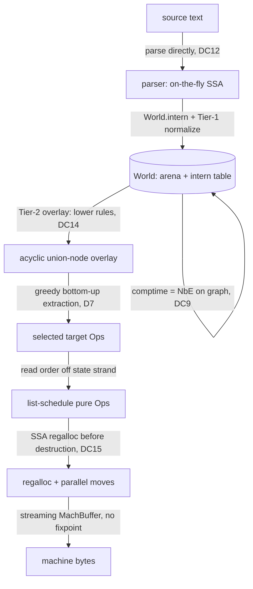

# Implementation Plan

*How to actually build Helix: concrete data structures, core-operation pseudocode, an honest LOC budget that substantiates the "dramatically smaller codebase" claim, a language/dependency recommendation, and a risk-marked milestone roadmap.*

This page turns the design spine into a buildable artifact. It is deliberately concrete: the
data structures are the ones you would type into a `src/` tree, the pseudocode is close enough
to compile, and the LOC budget is an estimate you can hold the project accountable to. Where a
component is genuinely hard — and the backend three (ISel, scheduler, register allocator) are
hard — it says so and cites the risk register (R1..R7) and design constraints (DC1..DC17, D1..D7)
from [Synthesis](research/00-synthesis.md).

---

## 1. Architecture at a glance

Everything lives behind one object, the **World** (the hash-consing factory + arena owner,
DC8). Source flows in through the parser, becomes graph nodes via the World's smart
constructors (which *are* the Tier-1 reducer and the comptime evaluator, DC9), and flows out as
machine bytes — no secondary IR at either end (D1, DC12/DC13).



The crucial structural facts that make this small: the graph is an **acyclic hash-consed DAG**
(DC7/DC8), there are **exactly six node forms** (DC17), every edge is a **value strand** (pure,
floats) or a **state strand** (linear effect skeleton, pinned), and there are **no phi nodes** —
region ports are block parameters (DC5). These invariants delete whole subsystems other IRs need
(SSA restoration, dominance recomputation, separate memory-SSA, a backend graph).

---

## 2. Core data structures

### 2.1 The arena and handles

Nodes live in a single growable arena owned by the World. References between nodes are 32-bit
indices (`NodeId`), never pointers — this keeps nodes `Copy`, makes serialization trivial, and
lets the intern table key on structure rather than address.

```rust
// 32-bit handle into the World's node arena. u32 is plenty: jlm's whole IR core is ~22.8k LoC
// of C++ and never approaches 4 billion live nodes. Niche-optimized so Option<NodeId> is 4 bytes.
struct NodeId(NonZeroU32);

struct TypeId(NonZeroU32);   // types ARE nodes (Const of a type), but a typed handle aids reading
struct StateId(NodeId);      // a NodeId known to carry a `state` type; newtype enforces DC4 at API level

struct World {
    nodes:    Vec<Node>,                 // the arena; index == NodeId
    intern:   HashMap<NodeKey, NodeId>,  // structural node -> id  (hash-consing, DC8)
    operands: Vec<NodeId>,               // flat operand pool; Ops hold a (start,len) slice into this
    rules:    RuleSet,                   // compiled Tier-1 (=>) and Tier-2 (~ / lower) rules, DC14
    overlay:  Overlay,                   // Tier-2 union nodes (append-only, acyclic)
    srcmap:   SourceMap,                 // NodeId -> source span side table, DC16
    fuel:     FuelBudget,                // per-call comptime step budget, DC11
}
```

### 2.2 The six node forms

A `Node` is a tagged union over the exactly six forms of the spine (DC17). Structural forms
(`Const`, `Op`) are immutable and interned; nominal forms (`Cond`, `Loop`, `Func`, `Module`)
introduce ports and host sub-graphs and are *not* interned by structure (they have identity).

```rust
enum Node {
    // --- Structural: pure, immutable, hash-consed, FLOAT ---
    Const(ConstNode),   // literals AND types: ty.int 32, const 42, a function type
    Op(OpNode),         // opcode + operands (+ optional state in/out); covers ISA ops after lowering

    // --- Nominal/region: mutable, introduce PORTS (= block params, DC5), host a body ---
    Cond(CondNode),     // gamma: symmetric conditional / switch
    Loop(LoopNode),     // theta: tail-controlled loop, expressed WITHOUT a graph cycle (DC7)
    Func(FuncNode),     // lambda: param ports, result ports, optional state in/out
    Module(ModuleNode), // omega/delta: top-level funcs, globals, recursion groups (recursion lives HERE, DC7)
}

struct OpNode {
    op:       Opcode,        // enum: Add, Sub, Mul, CmpLt, Select, Load, Store, ... + X64Lea, X64Add, ... after lowering
    ty:       TypeId,        // result type (itself a Const node)
    operands: Operands,      // (start: u32, len: u16) slice into World.operands  -> value-strand inputs
    state_in:  Option<StateId>,  // Some(..) == effectful Op (consumes a state token)
    state_out: Option<StateId>,  // Some(..) == produces the successor token; None for pure Ops
}

struct ConstNode { ty: TypeId, payload: ConstPayload }  // Int(i128) | Type(TypeKind) | Func(NodeId) | ...

// Region ports are block parameters: they are real value-defining nodes whose "definition" is
// "the k-th input port of region R". No phi anywhere (DC5).
struct Port { region: NodeId, index: u16, ty: TypeId }

struct CondNode {
    pred:     NodeId,            // scrutinee (value strand)
    in_ports: Operands,          // shared inputs to every branch region
    cases:    Vec<RegionBody>,   // one body per case; all yield the SAME result port types
    results:  Box<[TypeId]>,     // result port types
    state_in: Option<StateId>, state_out: Option<StateId>,
}
struct LoopNode {
    carried:  Operands,          // initial values of loop-carried ports (DC6 tail-controlled theta)
    body:     RegionBody,        // contains the `break unless` test and `continue (...)`
    state_in: Option<StateId>, state_out: Option<StateId>,
}
struct RegionBody { ports: Box<[Port]>, nodes: Vec<NodeId>, yields: Box<[NodeId]> }
```

### 2.3 The intern key (hash-consing, DC8)

Only structural forms are interned. The key is the *structure*, so structural equality becomes
pointer (id) equality, which gives GVN/CSE for free (D6). The pointer-equality fast path is valid
only for **closed terms** (DC8 caveat — open terms under a region binder must compare ports too).

```rust
enum NodeKey {
    Const(TypeId, ConstPayload),
    // operands compared by VALUE of the NodeId slice; state_in folded in so two loads of the same
    // address on DIFFERENT state tokens are NOT merged (linearity, DC4).
    Op(Opcode, TypeId, SmallVec<[NodeId; 3]>, Option<StateId>),
}
// intern():  key -> existing NodeId | freshly-arena'd NodeId.  This table IS automatic GVN.
```

### 2.4 The Tier-2 overlay (union nodes) and union-find

Tier 2 is used **sparingly** (D7) — primarily instruction-selection alternatives and a little
reassociation. It is an **acyclic, append-only** aegraph-style overlay (DC7), not equality
saturation. A union node says "these NodeIds are equivalent; pick one at extraction." We keep a
union-find purely to answer "are these already known-equal?" cheaply during rule application; the
*structure* is the immutable union-node tree, so we never rebuild or run a fixpoint.

```rust
struct Overlay {
    // append-only binary union nodes: "value `id` may also be realized as `alt`"
    unions: Vec<(NodeId /*canonical*/, NodeId /*alternative*/)>,
    uf:     UnionFind,            // NodeId -> representative; for dedup only, NOT for extraction order
    cost:   HashMap<NodeId, u32>, // memoized extraction cost (bottom-up DP, D7)
}
```

### 2.5 Source map (DC16)

A side table, never inline in the node (keeps the arena dense and the intern key pure). Stable
*semantic* names, explicitly avoiding Thorin's non-semantic names (DC16, R5).

```rust
struct SourceMap {
    spans: HashMap<NodeId, Span>,         // NodeId -> (file, byte-range)
    names: HashMap<NodeId, Box<str>>,     // optional stable %name for printing/diffing
}
```

---

## 3. Core operations (pseudocode)

The whole engine is six routines. They are short because the invariants do the heavy lifting.

### 3.1 Smart constructor = intern + Tier-1 normalize (DC8, the MAIN engine)

Every node-construction goes through this. It applies oriented `=>` rules to a *local* fixpoint
at construction time — constant folding, algebraic identities, comptime beta/delta — then
interns. No worklist sweeps, no saturation (avoids R5's V8 cache-thrash and the e-graph blowup).

```
fn make(op, ty, operands, state_in) -> NodeId:
    node = Op{op, ty, operands, state_in, state_out: fresh-if-effectful}
    loop:                                  # local fixpoint, almost always 0-2 iterations
        match = rules.tier1.first_match(node, world)   # oriented => rules only
        if none: break
        node = apply_rewrite(match, node)              # may recurse into make() for the RHS
    return intern(node)                    # hash-cons: structural eq == id eq == GVN (D6)

fn intern(node) -> NodeId:
    if node is structural:
        key = key_of(node)
        if id = world.intern.get(key): return id       # CSE hit, free
        id = world.nodes.push(node); world.intern.insert(key, id); return id
    else:                                  # nominal (region/func/module): fresh identity, no intern
        return world.nodes.push(node)
```

### 3.2 Pattern match + rewrite apply (the one rule DSL, DC14)

The same matcher serves peepholes, comptime folds, and lowering. Rules compile to a decision
trie (ISLE-style) so match work is shared; here is the interpreter form for clarity. `{..}` is a
host computation (comptime fold); guards (`if`) are host predicates.

```
fn first_match(node, world) -> Option<Binding>:
    for rule in rules.indexed_by_opcode[node.op]:        # opcode-indexed, priority-ordered
        if let Some(b) = match_pat(rule.lhs, node, world):
            if rule.guard.eval(b): return Some((rule, b))
    None

fn apply_rewrite((rule, b), node) -> Node:
    match rule.kind:
        Oriented(=>):  build_rhs(rule.rhs, b)            # Tier-1: replace in place
        Equiv(~):      overlay.add_union(node, build_rhs(rule.rhs, b)); node   # Tier-2: record alt
        Lower(@cost):  let alt = build_rhs(rule.rhs, b)
                       overlay.cost[alt] = rule.cost
                       overlay.add_union(node, alt); node                       # Tier-2 ISel alt
```

Example rules (canonical DSL — Tier-1 is eager `=>`, Tier-2 is `~`/`lower`, used sparingly):

```
rule add-zero : (add ?x (const _ 0)) => ?x
rule fold-add : (add (const ?t ?a) (const ?t ?b)) => (const ?t {a + b})   ; {..} host fold
rule mul-pow2 : (mul ?x (const i32 2)) => (shl ?x (const i32 1))
rule comm-add : (add ?x ?y) ~ (add ?y ?x)                                 ; Tier-2 only, sparingly
lower lea     : (add ?b (mul ?i (const i64 ?s))) => (x64.lea ?b ?i ?s) @cost 1  if member(?s,{1,2,4,8})
```

### 3.3 Comptime = NbE eval/reify (DC9/DC10/DC11)

Comptime is not a separate interpreter — it is Tier-1 reduction expressed as
Normalization-by-Evaluation. `eval` runs the graph into a semantic domain; `reify` turns the
result back into graph nodes. **Dynamic (run-time-unknown) values become neutral terms**, which
reify back into `Op` nodes — this is the clean static/dynamic split. Bounded by per-call fuel and
memoized by `(function, static-args)`, sound only under purity (paired with the state strand).

```
fn eval(node, env, fuel) -> Value:                 # Value = Static(const) | Neutral(graph fragment)
    fuel.spend(1)?                                  # localizable budget, reported on exhaustion (R2)
    match node:
        Const c            -> Static(c)
        Port p             -> env.lookup(p)         # may be Neutral if argument is run-time
        Op{op, args, st}   ->
            vs = args.map(|a| eval(a, env, fuel))
            if all vs Static and op pure:
                return Static(host_fold(op, vs))    # the SAME folds as Tier-1 {..}
            else:
                return Neutral(op, vs, st)          # dynamic: stays in the graph
        Func f if f.filter == @comptime || arg.is(static):
            return specialize(f, static_args, fuel) # memoize by (f, static-args)
        Cond/Loop          -> reduce per region; unknown predicate => Neutral region

fn reify(value) -> NodeId:                          # back to graph; neutrals become Ops
    match value:
        Static c           -> world.const(c)
        Neutral(op,vs,st)  -> world.make(op, ty, vs.map(reify), st)   # re-enters smart constructor
```

Staging is programmer-visible via filters/annotations (Thorin Schism-style, DC10), e.g.
`fn f(static %n: i32, %x: i32)` specializes `%n` aggressively and defers `%x`. **Honest:** comptime
is Turing-complete; no specializer both always terminates and always maximally specializes (R2).
Fuel bounds it but the budget leaks into UX exactly as Zig's quota / C++'s `-fconstexpr-steps`
do — we report a *localizable* budget rather than an ungettable global one (DC11).

### 3.4 Greedy bottom-up extraction (Tier-2 selection, D7)

After lowering rules have populated the overlay with target-Op alternatives, pick a min-cost
tiling by bottom-up DP up the **pure value strand**, *stopping at region-port and state-strand
boundaries* (DC15). We deliberately do **not** solve optimal DAG extraction — it is NP-complete,
and Cranelift's data says saturation/optimality buys ~0.1% for real cost (D7, R3).

```
fn extract(id) -> (NodeId, cost):                   # memoized; acyclic so terminates
    if let Some(best) = overlay.cost_done(id): return best   # memo holds the (NodeId, cost) pick
    best = (id, cost_of(id) + sum(children.map(|c| extract(c).cost)))
    for alt in overlay.alternatives(id):            # union-node options, usually 1.13 avg
        c = alt.cost + sum(alt.children.map(|c| extract(c).cost))
        if c < best.cost: best = (alt, c)
    overlay.memo(id, best); return best
```

### 3.5 Scheduler — read order off the state strand, list-schedule the floats (DC15)

The state strand IS the schedule skeleton: effectful Ops are already linearly ordered by their
state tokens (DC4). Pure floating Ops are list-scheduled into that skeleton per region. A unique
legal order always exists (DC6), so no oscillation (failure mode 4).

```
fn schedule(region) -> [NodeId]:
    seq = state_strand_order(region)                # the pinned effect skeleton, in linear order
    ready = pure ops whose operands are all placed
    for slot in seq.gaps():                         # between consecutive effects
        place ready ops by priority (critical-path length) until operands force a wait
    return interleaved order                        # pure ops sunk as late / hoisted as early as legal
```

### 3.6 Encoder loop — streaming MachBuffer, no fixpoint (DC13)

Per-instruction `emit` into a streaming buffer that fixes up branches inline (MachBuffer-style):
bind labels as emitted, run a tail branch-peephole, insert veneers/islands on deadlines. No
relaxation fixpoint, no post-pass code motion.

```
fn encode(insts) -> Vec<u8>:
    buf = MachBuffer::new()
    for inst in insts:
        inst.emit(&mut buf)                         # writes bytes; declares label-uses
        buf.bind_pending_labels()
        buf.branch_peephole_tail()                  # invert / thread / elide, linear time
        if buf.near_range_deadline(): buf.emit_island()   # veneers JIT, no fixpoint
    buf.finish()
```

---

## 4. LOC budget (substantiating "dramatically smaller codebase")

Honest engineering estimates for a *first mature* single-ISA (x86-64) implementation, one source
language frontend. Ranges reflect uncertainty; the backend three carry it (R3). The total lands
in the **~6k–9k LoC** band — an order of magnitude under Cranelift and three+ orders under LLVM.

| Component | Est. LoC | Notes / which DC it implements |
|---|---:|---|
| Core graph + arena + interning | 600–900 | Node arena, `NodeId`, intern table, the six forms (DC7/DC8/DC17) |
| Rule engine + DSL compiler | 700–1000 | parser for `=>`/`~`/`lower`, decision-trie matcher, guards/host folds (DC14) |
| Rule library (folds, peepholes, identities) | 400–700 | the actual `=>` rules; grows over time, individually tiny |
| Comptime / NbE (eval, reify, fuel, memo) | 500–800 | eval→reify, neutral terms, filters, fuel budget (DC9/DC10/DC11) |
| Lowering rules + greedy extraction | 600–1000 | `lower @cost` rules + overlay + bottom-up DP (DC15, D7) |
| Scheduler (state-strand + list-sched) | 300–500 | read skeleton order, list-schedule floats (DC6/DC15) |
| **Register allocator (one ISA)** | **1500–2500** | **heaviest part**; SSA backtracking + live-range splitting + parallel moves (R3) |
| **Encoder / MachBuffer (one ISA)** | **800–1400** | per-inst `emit`, label fixups, veneers/islands; x86-64 encoding tables are bulky (R3) |
| Frontend (one language, on-the-fly SSA) | 800–1200 | parse directly into graph, Braun-2013 SSA, control→Cond/Loop, effects→state (DC12) |
| Text + binary serde (print/parse/diff) | 400–700 | canonical textual format + source map; diffable from day one (DC16) |
| **Total** | **~6.6k–10.7k** | center of mass ≈ **7.5k–8.5k LoC** |

Comparison (from [Synthesis](research/00-synthesis.md) and [08-backend](research/08-backend-direct-codegen.md)):

| System | Codebase size | What dominates |
|---|---:|---|
| **Helix (this plan)** | **~6k–9k LoC** | RA + encoder are the heavy parts (R3) |
| jlm (RVSDG) | ~161k LoC C++ | **IR core only ~22.8k**; the LLVM↔RVSDG round-trip bridge is ~94.6k (the round-trip is the cost) |
| MimIR / Thorin 2 | ~32k LoC C++ | core `src/mim` ~9.4k + ~8.4k across 21 plugins; still emits textual LLVM IR |
| Cranelift | ~100k+ LoC Rust | ISLE rules ~27k DSL; `regalloc2` >10k dense Rust |
| LLVM | millions | the reference; multiple IRs (IR → SelectionDAG/gMIR → MIR) |

**Why Helix is smaller is structural, not heroics (D1):** we delete the two bridges everyone else
pays — no AST→IR front-end lowering (DC12) and no secondary backend IR (DC13). jlm's own numbers
make the point: ~6× more code lives in the round-trip than in the IR core. We also delete SSA
restoration, dominance recomputation, and a separate memory-SSA, because single-origin edges +
block parameters + the state strand make those invariants hold by construction (DC2/DC5/DC4).

**Honest caveat (R3):** the RA and encoder rows are where the bytes go and where the schedule
slips. regalloc2 is >10k LoC of dense Rust *for a reason* — combined schedule+RA is NP-hard,
optimal ISel/extraction is NP-complete, cost is non-local, and SSA chordality evaporates after
destruction. A single-ISA allocator at 1.5k–2.5k LoC will be *correct and competitive*, not
state-of-the-art, until matured. This directly threatens the "matches the best graph IRs"
optimization claim on register-pressure-heavy code (R1). We do **not** claim to beat LLVM -O3
output quality (R1/R3); the claim is *matching* the best graph IRs in far less code, with
comptime and codegen unified into the graph (the honest pitch).

---

## 5. Implementation language and dependencies

**Recommendation: Rust.** Rationale:

- **Arena + index-handle ergonomics, no GC.** The `NodeId(u32)` / `Vec<Node>` arena pattern is
  idiomatic Rust and gives cache-dense, serializable, `Copy` handles — exactly what the
  append-only acyclic graph (DC7/DC8) wants, with no borrow-checker fights because nodes refer to
  each other by index, not reference.
- **Existence proof in the same language.** Cranelift (VCode + regalloc2 + MachBuffer) is the
  whole-backend existence proof for D1/DC13 and it is Rust; we can study and, where licenses
  permit, lean on its regalloc design rather than reinventing the NP-hard parts.
- **Linearity helper.** The `StateId` newtype + move semantics let us *structurally* discourage
  using a state token twice (closing MimIR's unenforced-linearity hole, DC4) — Rust's affine
  types are a natural fit even though we still enforce single-use in the verifier.
- **SMT-verifiable rules path.** The one rule DSL (DC14) should be SMT-checkable (VeriISLE-style);
  Rust has good `z3`/`egg` ecosystem bindings if we want offline rule verification (kept *out* of
  the runtime).

**Zig is the credible alternative** — comptime-as-a-language-feature is philosophically aligned
with DC9, and the manual-allocator story suits arenas — but it lacks Rust's affine-type leverage
for linearity and the mature Cranelift-shaped backend prior art. Pick Rust unless the team's
existing expertise is Zig.

**External dependencies: near-zero by design.** This is a selling point, not an accident.

| Need | Choice | Note |
|---|---|---|
| Hash map for interning | `hashbrown` (or std `HashMap`) | swappable; the only hot data structure |
| Small-vector for operands | `smallvec` | optional; inline ≤3 operands avoids heap churn |
| Register allocator | study `regalloc2`; ship our own slim one | avoid a hard runtime dep; R3 is owned, not outsourced |
| SMT (rule verification) | `z3` bindings, **build-time only** | never linked into the compiler binary |
| CLI / diff tooling | std + a tiny arg parser | tooling is first-class (DC16) but dependency-light |

No LLVM, no MLIR, no external IR library — that is the entire point of D1 (no round-trip).

---

## 6. Milestone roadmap

Six build milestones plus evaluation. **Load-bearing risk milestones are marked.** The honest
ordering principle: get the *cheap structural wins* (M0–M3) working and demoable first, then take
on the NP-hard backend (M5) where the project's real risk concentrates.

| Milestone | Deliverable | Proves | Risk load |
|---|---|---|---|
| **M0** Core graph + text | Arena, `NodeId`, intern table, six node forms, canonical printer/parser, source map | DC2/DC5/DC7/DC8/DC16/DC17; you can round-trip the canonical textual format | low |
| **M1** Reduction + rules | Rule DSL compiler, decision-trie matcher, Tier-1 `=>` smart constructors, GVN/fold/DCE emergent | DC8/DC14, D6/D7 — structural GVN/LICM/DCE with no worklist | low–med |
| **M2** Comptime | NbE eval/reify, neutral terms, filters/`static` annotations, per-call fuel, memoization | DC9/DC10/DC11, D3 | **HIGH (R2, R7)** — termination wall + "does the one DSL stretch to PE" |
| **M3** Frontend | Parse one language directly into the graph; control→Cond/Loop, mutation/IO→state strand, on-the-fly SSA | DC12, D1 (input half) | med |
| **M4** ISel + extraction | `lower @cost` rules, Tier-2 overlay (union nodes), greedy bottom-up extraction for x86-64 | DC14/DC15, D7 | med–**HIGH (R3)** — non-local cost, NP-complete optimal tiling |
| **M5** Scheduler + regalloc + encoder (one ISA) | State-strand schedule, list-sched floats, SSA backtracking RA + parallel moves, streaming MachBuffer | DC13/DC15, D1 (output half) | **HIGHEST (R3)** — owns ISel+schedule+RA, all NP-hard; output quality lags LLVM until mature |
| **M6** Evaluation | Benchmark vs the best graph IRs and LLVM -O2/-O3; LOC audit; comptime fuel diagnostics | the honest pitch (R1) | **HIGH (R1)** — this is where "matches, in far less code" is confirmed or refuted |

```
M0 ─ M1 ─ M2 ──────────────┐                 (M2 can proceed in parallel with M3 once M1 lands)
              \             │
               └─ M3 ─ M4 ─ M5 ─ M6
```

**Risk concentration, stated plainly:**

- **M2 (comptime)** carries **R2** (termination/divergence is fundamentally unsolved — fuel bounds
  it but leaks into UX) and **R7** (nobody has shown the *same* rule engine serving general
  filter-and-fuel partial evaluation; folding constants is easy, staging higher-order/recursive
  comptime is unproven). Ship the fuel diagnostics in M2, not as an afterthought.
- **M4 + M5 (backend)** carry **R3** — owning ISel + scheduling + register allocation means owning
  NP-hard problems with non-local cost; output quality will lag LLVM until mature. This is the
  single biggest engineering risk and the reason RA + encoder dominate the LOC budget.
- **M6 (evaluation)** is where **R1** is settled. The defensible result is "matches the best graph
  IRs (which themselves match, not beat, LLVM -O3) in dramatically less code." Claiming strict
  superiority over LLVM -O3 output quality is the riskiest possible framing and we do not make it.

A reasonable MVP cut for an early demo is **M0–M3 + a stub backend** (naive linear-scan RA, no
ISel rules, direct opcode→encoding): it proves D1's parse-in/emit-out story and the comptime
engine end-to-end while deferring the R3 quality grind to M4/M5.

---

## See also

- [Overview](00-overview.md) — the one-graph-one-reduction thesis this plan builds.
- [Design Rationale](10-design-rationale.md) — why each DC/D drives a structure here.
- [Core Model](11-core-model.md) — the six node forms and two strands in depth.
- [Format](12-format.md) — the canonical textual/binary serde this plan budgets for.
- [Reduction Engine](14-reduction-engine.md) — Tier-1/Tier-2 detail behind §3.1–§3.4.
- [Comptime](15-comptime.md) — NbE, filters, and fuel behind §3.3 and M2.
- [Codegen](17-codegen.md) — the backend pipeline behind §3.4–§3.6 and M4/M5.
- [Frontend](18-frontend.md) — parse-directly-into-the-graph behind M3.
- [Evaluation](20-evaluation.md) — how M6 settles R1.
- [Risks and Open Problems](22-risks-and-open-problems.md) — R1..R7 in full.
- [Synthesis](research/00-synthesis.md) — DC1..DC17, D1..D7, R1..R7, and the LOC anchors.
