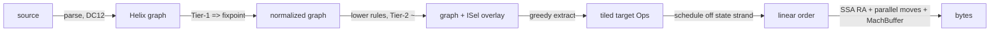

# Worked Examples (End-to-End)

_Four complete source-to-silicon walkthroughs that exercise the whole Helix pipeline on small, concrete programs: parse-direct into the graph, Tier-1 eager normalization, Tier-2 lowering + greedy cost extraction, schedule off the state strand, and a few real machine instructions. Every step names the strands touched and the rules fired._

This page is the integration test of the design spine. If anything here contradicts a sibling
page, the sibling page (and ultimately [research/00-synthesis.md](research/00-synthesis.md)) wins.
Each example is deliberately tiny so the rewrite at each step is fully visible.

## How to read these walkthroughs

Every Helix edge is one of exactly two **strands** (the central metaphor):

- **VALUE strand** (pure): duplicable, foldable, FLOATS freely, placed only at scheduling time.
- **STATE strand** (linear effect skeleton): a value of type `state`, threaded LINEARLY (used
  exactly once), PINNED and ordered. Effectful `Op`s consume one state token and produce a new one.

The pipeline stages and the spine IDs they realize:

| Stage | What happens | Strands touched | Spine |
|---|---|---|---|
| Parse | source builds Helix nodes directly, on-the-fly SSA (Braun '13), no AST→IR, no front-end IR | both, interned as built | DC12 |
| Tier-1 | eager oriented normalization (`=>`) at construction: fold / algebraic / CSE-via-hash-cons / comptime β/δ | value strand rewrites; state strand only reordered, never folded | DC8, DC9, D6 |
| Lower | `lower` rules rewrite portable `Op`s into TARGET `Op`s, recorded as Tier-2 `~` alternatives | value strand only; pinned at skeleton/port leaves | DC13, DC14, DC15 |
| Extract | greedy bottom-up min-cost tiling (BURS-style DP) up the value strand, stopping at port / state boundaries | value strand | DC15, D7 |
| Schedule | read order off the state strand; list-schedule floating pure `Op`s into it | both | DC3, DC6 |
| RA + encode | SSA regalloc BEFORE SSA destruction; resolve port transfers as parallel moves; stream bytes (MachBuffer) | both | DC15, R3 |

Notation reminders (canonical): `=>` is an oriented Tier-1 rewrite (eager); `~` is a Tier-2
equivalence (overlay / ISel only, used sparingly); `lower ... @cost` is a lowering rule with a
machine cost and optional `if` guard; `{..}` is a comptime host computation; `?x` is a pattern
variable. Types are ordinary `Const` values (`%i64 = ty.int 64`). There are NO phi nodes
anywhere — merges and loop-carried values are region **ports** (block parameters, DC5).



---

## Example A — Pure arithmetic: GVN + fold + strength-reduction + lea ISel

Goal: show the Tier-1 engine doing value numbering, constant folding, and strength reduction for
free during construction, then Tier-2 folding an address computation into a single `x64.lea`.

### A.0 Source

```c
// 64-bit elements; idx is runtime, base is a pointer
long get(long *base, long idx) {
    long off = idx * 8;        // element stride
    long *p  = base + off;     // address arithmetic
    return *p + (idx * 8);     // note: idx*8 appears twice
}
```

### A.1 After parse (DC12) — naive, before any normalization fires

The parser interns expression nodes into the value strand. The load is effectful, so it consumes
a state token. Shown here _as if_ nothing were normalized, to make the redundancy visible:

```
; %i64, %ptr are Const type-values (types are values, DC1)
func @get(%base: ptr, %idx: i64, %s0: state) -> (i64, state) {
  %off0 = mul %idx, 8            ; value strand
  %p    = add %base, %off0       ; value strand (address calc is an ordinary Op)
  (%v, %s1) = load %p, %s0       ; effectful Op: consumes %s0, produces %s1
  %off1 = mul %idx, 8            ; <-- structurally identical to %off0
  %r    = add %v, %off1
  return (%r, %s1)
}
```

### A.2 After Tier-1 eager normalization (DC8 / D6)

Because every construction goes through the World factory, the rewrites below fire _at build
time_, not in a later sweep — no worklist, no equality-saturation fixpoint:

- **CSE via hash-consing (DC8):** `mul %idx, 8` is interned once; the second construction returns
  the _same node_ (structural equality == pointer equality). `%off1` collapses into `%off0`. This
  is automatic GVN, no separate pass.
- **Strength reduction** rule fires on the surviving multiply:

  ```
  rule mul-pow2 : (mul ?x (const i64 8)) => (shl ?x (const i64 3))
  ```

Result (single shared `%off`):

```
func @get(%base: ptr, %idx: i64, %s0: state) -> (i64, state) {
  %off = shl %idx, 3             ; strength-reduced; shared by both uses (GVN)
  %p   = add %base, %off
  (%v, %s1) = load %p, %s0
  %r   = add %v, %off            ; reuses the one %off
  return (%r, %s1)
}
```

Note the state strand (`%s0 -> %s1`) was never touched by Tier-1 — pure-value rewriting cannot
fold or reorder an effect (failure-mode 11; DC3). Only the value strand floats and rewrites.

### A.3 Lowering + Tier-2 alternatives (DC13 / DC14)

Lowering rules rewrite portable `Op`s into target `Op`s and record them as Tier-2 `~`
alternatives in the acyclic, append-only overlay (aegraph-style). The key rule is the `lea`
absorber — but note it matches the _pre_-strength-reduced shape, so the World also keeps the
`add (mul ...)` form available as an equivalence so the absorber can match:

```
; the canonical lea lowering from the spine:
lower lea : (add ?b (mul ?i (const i64 ?s))) => (x64.lea ?b ?i ?s) @cost 1
            if member(?s, {1,2,4,8})

; address-form equivalence so lea can re-absorb a strength-reduced shift (Tier-2, sparingly):
rule shl3-mul8 : (shl ?x (const i64 3)) ~ (mul ?x (const i64 8))
```

For `%p = add %base, %off`, the overlay now records two e-class members for the address:

```
%p : { add %base, (shl %idx 3)              @ cost 2   ; shl + add
     ~ x64.lea %base, %idx, 8               @ cost 1 } ; one fused instruction
```

The other use of `%off` (`add %v, %off`) is a plain integer add, _not_ an address, so the `lea`
rule does not apply there; `%off` stays as a `shl` feeding the second `add`.

### A.4 Greedy bottom-up cost extraction (DC15 / D7)

Extraction walks _up the pure value strand_, stopping at the state-strand boundary (the `load`
consumes `%p`, which pins where the address must be materialized). BURS-style DP picks min cost:

| Node | Candidate tiles | Chosen | Why |
|---|---|---|---|
| address of load | `shl`+`add` (cost 2) vs `x64.lea` (cost 1) | `x64.lea %base,%idx,8` | absorbs `%off`'s shift into one op |
| `%r = add %v, %off` | `add` over `shl` (cost 2) | `shl`+`add` | this `%off` is a data value, not an address |

Because `%off` is _shared_ (one feeds the address, one feeds the integer add), this is a DAG, and
optimal DAG tiling is NP-complete (research/08). Helix does NOT chase optimal: greedy keeps the
`shl` materialized once for the integer add, and _also_ lets `lea` recompute the scaled index
internally. That duplication of the `*8` is the deliberate D7 trade — bounded and greedy beats
NP-hard extraction for ~free.

### A.5 A few real machine instructions

After schedule (trivial here — one state edge), SSA RA, and encode:

```asm
; %base -> rdi, %idx -> rsi, return in rax  (System V)
get:
    lea   rax, [rdi + rsi*8]   ; x64.lea: address calc, cost-1 tile
    mov   rax, [rax]           ; the load (effectful Op, pinned by state strand)
    mov   rcx, rsi
    shl   rcx, 3               ; %off for the integer add (strength-reduced *8)
    add   rax, rcx             ; %v + off
    ret
```

Takeaways: GVN, fold, and strength-reduction were emergent from Tier-1 construction (D6, not a
pass pipeline); the one genuinely target-specific decision (`lea`) was a single bounded Tier-2
rule (D7 — the restraint of bounded greedy ISel over full EqSat). Honest note: a hand-tuned LLVM `-O3` backend might reuse the `lea`'s scaled index for the
second add and drop the separate `shl`; greedy extraction can leave such cross-tile reuse on the
table (R1/R3).

---

## Example B — Comptime-specialized generic: `pow(x, static 5)` via NbE

Goal: show comptime IS Tier-1 reduction (DC9), driven by a programmer-visible `static` filter
(DC10), implemented as Normalization-by-Evaluation with **neutral terms** for the dynamic value,
and bounded by per-call **fuel** (DC11).

### B.0 Source

```rust
// `n` is a compile-time (static) parameter; `x` is runtime.
fn pow(static n: i32, x: i64) -> i64 {
    let mut acc: i64 = 1;
    let mut i = 0;
    while i < n { acc = acc * x; i = i + 1; }
    acc
}

fn quintic(x: i64) -> i64 { pow(5, x) }   // call site fixes n = 5
```

### B.1 After parse (DC12)

`pow` parses into a `Func` with a `static`-annotated parameter port and a tail-controlled `Loop`
region (theta), expressed WITHOUT a graph cycle (DC7). The loop-carried `acc` and `i` are ports:

```
func @pow(static %n: i32, %x: i64) -> i64 {
  %r = loop (%acc = 1, %i = 0) : i64 {
    %c = cmp.lt %i, %n
    break unless %c -> %acc
    %acc1 = mul %acc, %x
    %i1   = add %i, 1
    continue (%acc1, %i1)
  }
  return %r
}
```

### B.2 Comptime reduction at the `quintic` call site (DC9 / DC10 / DC11)

The default staging policy specializes `static` arguments aggressively. Calling `pow(5, x)` fixes
`%n = const i32 5`; `%x` is run-time-unknown, so NbE represents it as a **neutral term** — a
placeholder that reification will turn back into an `Op` node. The Tier-1 engine evaluates the
loop in the semantic domain:

- The loop guard `cmp.lt %i, %n` is now `cmp.lt %i, 5`. With `%i` static (`0,1,2,3,4`), each
  guard folds to a known boolean via `fold-cmp`. The loop is fully **unrolled** (this is the same
  reduction primitive as inlining/folding — D3).
- `%acc * %x` over a neutral `%x` cannot fold to a constant; instead reification emits a chain of
  `mul` `Op` nodes — the neutral term flows through and becomes graph structure.
- Fuel: each unroll step debits the per-call budget; here 5 iterations cost 5 units, reported and
  far under budget. (Honest: comptime is Turing-complete; fuel bounds it but leaks into UX — R2.)

Rules involved (all `=>`, Tier-1):

```
rule fold-cmp : (cmp.lt (const ?t ?a) (const ?t ?b)) => (const i1 {a < b})
rule beta-loop-static : (loop (...static-bounds...)) => <unrolled body>   ; NbE unroll
rule mul-one  : (mul (const i64 1) ?x) => ?x                              ; drops acc=1 seed
```

### B.3 After Tier-1 reduction — fully residualized

NbE reifies the neutral `%x` back into a straight-line value-strand chain. `quintic` is now a
pure function with no loop, no `state` (it is side-effect free, so it has no state edge at all —
pure ops have no state strand, DC3):

```
func @quintic(%x: i64) -> i64 {
  %p1 = mul %x,  %x      ; acc=1 seeded then mul-one drops the 1; x^2
  %p2 = mul %p1, %x      ; x^3
  %p3 = mul %p2, %x      ; x^4
  %p4 = mul %p3, %x      ; x^5
  return %p4
}
```

Hash-consing (DC8) means the four `mul`s are distinct nodes (different operands) but any common
subterm across call sites would be shared automatically. A second, redundant `quintic` call with
the same argument node interns to the same graph — comptime results are hermetic and memoized by
`(function, static-args)`, sound only under purity (DC11).

### B.4 Lowering + extraction + machine code

No address arithmetic or target-fusion opportunity here; lowering maps `mul` → `x64.imul`. The
extraction is trivial (each `mul` is its own cost-1 tile). Schedule is a single chain on the value
strand (no state strand to read).

```asm
; %x -> rdi, return in rax
quintic:
    mov   rax, rdi
    imul  rax, rdi      ; x^2
    imul  rax, rdi      ; x^3
    imul  rax, rdi      ; x^4
    imul  rax, rdi      ; x^5
    ret
```

Takeaway: a generic was specialized with the same engine that does optimization — no separate
comptime interpreter (D3). The static/dynamic split fell out of NbE neutral terms. Comptime-built
**tables** work the same way: a `@comptime fn build_table() -> [i64; 256]` runs entirely in Tier-1
and reifies to a `Const` array value (a single interned node), with fuel debited per element.

---

## Example C — Loop-invariant code motion via floating + a real lowered loop

Goal: show LICM emerging from pure values **floating** (not a bespoke pass), the scheduler placing
the invariant outside the loop, and a tail-controlled `Loop` region lowered to a real machine loop
whose loop-carried ports become **parallel moves** at SSA destruction (DC5 / DC15).

### C.0 Source

```c
void scale(int *a, int n, int k, int s) {
    for (int i = 0; i < n; i++)
        a[i] = a[i] + k * s;     // k*s is loop-invariant
}
```

### C.1 After parse (DC12)

The store is effectful, so the loop threads a `state` port alongside the value-carried `%i`. Note
`%inv = mul %k, %s` is parsed _inside_ the loop body, as written:

```
func @scale(%a: ptr, %n: i32, %k: i32, %s: i32, %st0: state) -> state {
  %r = loop (%i = 0, %st = %st0) : state {
    %c = cmp.lt %i, %n
    break unless %c -> %st
    %inv  = mul %k, %s                       ; value strand — depends on nothing loop-carried
    %off  = mul %i, 4
    %p    = add %a, %off
    (%v, %st1) = load %p, %st                ; effectful: consumes %st, produces %st1
    %v2   = add %v, %inv
    %st2  = store %p, %v2, %st1              ; effectful: consumes %st1, produces %st2
    %i1   = add %i, 1
    continue (%i1, %st2)
  }
  return %r
}
```

### C.2 LICM is not a pass — it is where a pure value is allowed to float (DC3 / D7)

`%inv = mul %k, %s` is on the value strand and depends only on `%k` and `%s`, which are NOT
loop-carried ports. A pure value's _placement is free until scheduling_: it is anchored only by
its true data dependencies, never by the syntactic position it was parsed at. So Helix does not
"hoist" `%inv` with a transform; the scheduler simply observes that nothing inside the loop region
feeds it and places it at its earliest legal point — outside the loop.

Contrast: `%off = mul %i, 4` depends on the loop-carried `%i`, so it is pinned _inside_. This is
exactly Click's Global-Code-Motion intuition (early/late placement) reused for free, and the same
mechanism gives sinking.

After scheduling decides placement (the graph is unchanged; only the schedule annotation differs):

```
func @scale(%a: ptr, %n: i32, %k: i32, %s: i32, %st0: state) -> state {
  %inv = mul %k, %s                          ; HOISTED: placed before the loop region
  %r = loop (%i = 0, %st = %st0) : state {
    %c = cmp.lt %i, %n
    break unless %c -> %st
    %off  = mul %i, 4                         ; stays inside (depends on %i)
    %p    = add %a, %off
    (%v, %st1) = load %p, %st
    %v2   = add %v, %inv                      ; uses the hoisted invariant
    %st2  = store %p, %v2, %st1
    %i1   = add %i, 1
    continue (%i1, %st2)
  }
  return %r
}
```

### C.3 Lowering + extraction inside the body

The address `add %a, (mul %i 4)` fires the `lea` lowering (`?s = 4 ∈ {1,2,4,8}`):

```
lower lea : (add ?b (mul ?i (const i32 4))) => (x64.lea ?b ?i 4) @cost 1 if member(4,{1,2,4,8})
```

Extraction walks up the value strand and stops at the state strand (the `load`/`store` are pinned
in the skeleton). The address becomes one `x64.lea`; the loop guard becomes a compare + conditional
branch.

### C.4 Schedule off the state strand, then lower the region to a real loop

The state strand `%st -> %st1 -> %st2` _is_ the side-effect skeleton: reading it off gives the
mandatory order load → store inside each iteration (DC3, failure-mode 2). The `Loop` region (an
acyclic node, DC7) is materialized as a back-edge in the _machine_ CFG only at this point — the
graph never had a cycle. Loop-carried ports `(%i, %st)` become register transfers; because both the
`continue` source and the loop header expect specific registers, they are resolved as **parallel
moves** at the very end (after SSA RA, before destruction; DC15).

### C.5 A few real machine instructions

```asm
; %a -> rdi, %n -> esi, %k -> edx, %s -> ecx ; loop counter %i -> r8d
scale:
    mov   eax, edx
    imul  eax, ecx           ; %inv = k*s, computed ONCE outside the loop (LICM-via-float)
    xor   r8d, r8d           ; i = 0
.Lhead:
    cmp   r8d, esi
    jge   .Ldone             ; break unless i < n
    lea   r9, [rdi + r8*4]   ; x64.lea: &a[i]  (cost-1 tile)
    mov   r10d, [r9]         ; load  (pinned by state strand)
    add   r10d, eax          ; + inv
    mov   [r9], r10d         ; store (ordered after load by the state strand)
    inc   r8d                ; i + 1  (parallel-move target for the %i port)
    jmp   .Lhead
.Ldone:
    ret
```

The `imul` for `k*s` sits above `.Lhead` — LICM with no LICM pass. Honest note: this is the case
where the float pays off (mostly-pure loop body); on an effect-saturated body little floats and the
win shrinks (R6).

---

## Example D — Fine-grained vs single state: when two stores may reorder

Goal: show that multiple INDEPENDENT fine-grained state tokens (per alias class / region) let
disjoint effects reorder, and that collapsing to one state forbids it. This is the D4 lever and the
RVSDG/jlm single-state regret (failure-mode 9; DC4).

### D.0 Source

```c
// p and q are known-disjoint (e.g. distinct restrict/noalias args, or distinct alloc regions)
void init(int *restrict p, int *restrict q) {
    *p = 1;     // store A
    *q = 2;     // store B
}
```

### D.1a Fine-grained state (the Helix default once alias info is present)

The alias pass writes its result back into the IR as **two independent state tokens** `%sp` and
`%sq` (D4: encode alias results as extra states). Store A threads only `%sp`; store B threads only
`%sq`. There is no ordering edge between them:

```
func @init(%p: ptr, %q: ptr, %sp0: state, %sq0: state) -> (state, state) {
  %sp1 = store %p, 1, %sp0        ; class P: independent
  %sq1 = store %q, 2, %sq0        ; class Q: independent — no state edge to A
  return (%sp1, %sq1)
}
```

Because A and B sit on _different_ state strands, neither consumes the other's token. The scheduler
may emit them in either order (or interleave with surrounding pure work). Linearity is still
enforced structurally (DC4): `%sp0` is used exactly once, `%sq0` is used exactly once — closing
MimIR's admitted unenforced-linearity hole.

### D.1b Single state (conservative — no alias info, or `p`/`q` may alias)

With one shared state token, the two stores are forced onto the same strand and B must consume the
token A produced. This is a true data dependency on the state strand, so the order is fixed:

```
func @init(%p: ptr, %q: ptr, %s0: state) -> state {
  %s1 = store %p, 1, %s0          ; A produces %s1
  %s2 = store %q, 2, %s1          ; B consumes %s1 -> ordered AFTER A
  return %s2
}
```

### D.2 What the scheduler is allowed to do

| Form | State strands | Legal machine orders | Why |
|---|---|---|---|
| Fine-grained (D.1a) | `%sp`, `%sq` independent | A;B **or** B;A | no state edge couples them — reorder is free |
| Single state (D.1b) | one `%s0→%s1→%s2` | A;B only | B consumes A's token; the skeleton fixes order |

The reorder freedom is not a heuristic the scheduler guesses (failure-mode 2 — V8 "got effect
order wrong for months"); it is _read directly_ off which token each effect consumes. Independence
is a structural fact in the representation, not a re-derived alias query (the CFG-can't-say-this
problem; DC4, failure-mode 9).

### D.3 Lowering + a few machine instructions

Both forms lower each `store` to a `mov [reg], imm`. Only the freedom differs:

```asm
; %p -> rdi, %q -> rsi  (both forms)
; FINE-GRAINED (D.1a): scheduler may pick either; here it interleaves to hide store latency
init_fine:
    mov   dword [rdi], 1     ; store A  (strand %sp)
    mov   dword [rsi], 2     ; store B  (strand %sq) — could legally precede A
    ret

; SINGLE STATE (D.1b): order is mandatory A-before-B
init_single:
    mov   dword [rdi], 1     ; store A  (must come first)
    mov   dword [rsi], 2     ; store B  (consumes A's token)
    ret
```

The two emitted sequences happen to look identical here, but the _constraint set_ differs: in the
fine-grained form the scheduler had a choice (and in a larger function could use it to fill a load
stall or overlap with pure work); in the single-state form it had none. The payoff is entirely
gated on the alias analysis populating fine state precisely — without it Helix degenerates to the
single-state form it set out to beat (R4).

---

## Cross-example summary

| Win | Example | Mechanism | Not a pass — emergent from | Spine |
|---|---|---|---|---|
| GVN / CSE | A, B | hash-consing == pointer equality | construction (Tier-1) | DC8, D6 |
| Constant fold | B | `fold-*` rules at construction | Tier-1 + NbE | DC8, DC9 |
| Strength reduction | A | `mul-pow2` `=>` rule | Tier-1 | DC14 |
| Instruction selection (`lea`) | A, C | `lower lea @cost` + greedy extract | Tier-2 bounded overlay | DC13, DC15, D7 |
| Comptime specialization / unroll | B | NbE eval→reify, neutral terms, fuel | Tier-1 = the optimizer | DC9, DC10, DC11, D3 |
| LICM / sinking | C | pure values float; scheduler places | placement, not a transform | DC3, D7 |
| Effect reordering | D | independent fine-grained state tokens | the representation itself | DC4, D4 |
| Linear effect order | C, D | state strand consumed exactly once | structural linearity | DC3, DC4 |

### Honest limitations recapped (do not overclaim)

- **R1 / R3 (output quality):** Example A's greedy extraction can miss cross-tile reuse a mature
  LLVM `-O3` backend would catch; owning ISel + schedule + RA means owning NP-hard problems, and
  Helix output quality lags LLVM until the backend matures. Helix's defensible pitch is _matches
  the best graph IRs in far less code with comptime + codegen unified into the graph_, not _beats
  -O3 output_.
- **R2 (comptime termination):** Example B's unroll is bounded by per-call fuel; comptime is
  Turing-complete, so fuel necessarily leaks into UX (reported, localizable, but present).
- **R4 (fine state needs alias analysis):** Example D's reorder freedom only exists when an alias
  pass can prove disjointness and write it back as separate states; otherwise Helix falls back to
  the conservative single-state form.
- **R6 (float caps out on effects):** Example C's LICM win is largest on mostly-pure loop bodies;
  effect-saturated code floats little, exactly where it would help most.

---

## See also

- [Core Model](11-core-model.md) — the six node forms, the two strands, ports-not-phi.
- [Textual Format](12-format.md) — the canonical syntax these examples use.
- [Types and Effects](13-types-and-effects.md) — the `state` type and fine-grained tokens (Example D).
- [Reduction Engine](14-reduction-engine.md) — Tier-1 normalization and the Tier-2 overlay (Examples A, B).
- [Comptime](15-comptime.md) — NbE, neutral terms, filters, fuel (Example B).
- [Optimizations](16-optimizations.md) — GVN/LICM/DCE as structural, emergent wins (Examples A, C).
- [Codegen](17-codegen.md) — lowering, greedy extraction, schedule, SSA RA, parallel moves (all examples).
- [Frontend](18-frontend.md) — parse-direct into the graph (the A.1/B.1/C.1/D.1 steps).
- [Risks and Open Problems](22-risks-and-open-problems.md) — R1–R7 expanded.
- [Glossary](23-glossary.md) — strand, port, neutral term, skeleton, tile.
- [Prior-art synthesis](research/00-synthesis.md) — DC#/D#/R#/failure-mode provenance.
